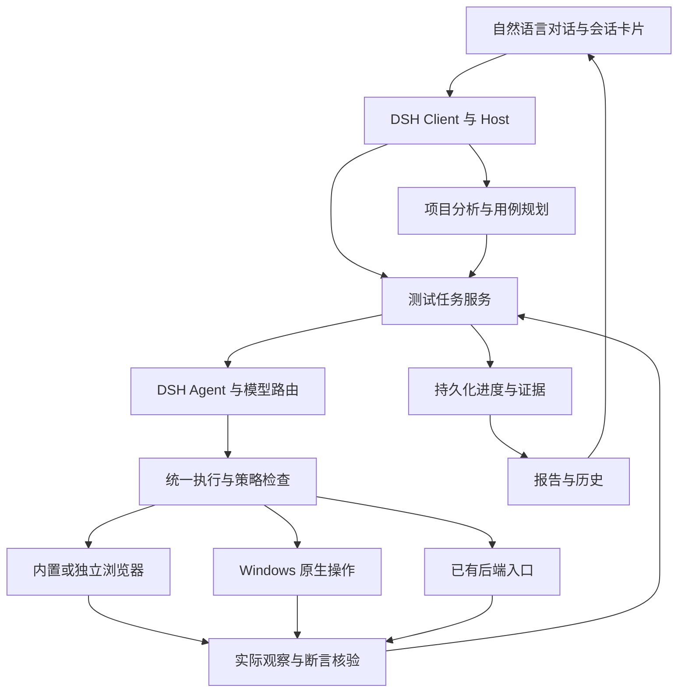

# Agent Note: Technical Architecture

Status: proposed

English | [中文](2026-09-28-web-testing-architecture.zh.md)

## Problem

The testing application needs to add its domain behavior while retaining the official desktop, agent loop, configuration, and upgrade model.

## Proposal

The [installable plugin plan](2026-10-04-web-testing-installable-plugin-plan.md) owns the newly selected delivery route: one external bundle in unmodified DSH, a dedicated test preset, and external Chrome/Edge first. It partially replaces this proposal's application-wide composition and private desktop integration; the business requirements and prior evidence remain retained.

Design state: proposed product design; partial probes and prototype work do not establish final implementation or acceptance. Product constraints come from [Product Requirements R01–R58](../feature/2026-09-28-web-testing-requirements.md); result fields follow the [Test Case and Report Specification](../feature/2026-09-28-web-testing-test-case-report-spec.md); delivery is governed by the [Acceptance Criteria](../testing/2026-09-28-web-testing-acceptance.md). [Baseline and Upstream Upgrades](../process/2026-09-28-web-testing-upstream-baseline.md) owns the baseline and upstream differences. The test services, operations, and entities in this document are proposed additions for this application, not interfaces already provided by DSH.

The first release targets Windows 10 22H2 (build 19045) and later, x64; ARM64 and physical mobile devices are deferred. Project onboarding is not restricted by programming language or framework. Users provide the complete code and start the application under test; this tool tests, analyzes, and reports. Every execution path keeps the tested source code, configuration, and dependencies read-only.

Detailed design entry points: [Interfaces and Execution DD01–DD05](2026-09-28-web-testing-design-execution.md), [Data and Recovery DD06–DD09](2026-09-28-web-testing-design-recovery.md), and [Models and Release DD10–DD13](2026-09-28-web-testing-design-models-release.md). These documents define concrete interfaces, fields, owners, commit order, and verification scenarios; this document retains the overall responsibilities without duplicating detailed schemas. The user has confirmed C01: operations are controlled at the application level under the current Windows account; actions whose source-code safety cannot be established are blocked, with no promise of operating-system-level isolation.

**TD01: Baseline and Module Responsibilities**

Reuse the official Electron desktop, DSH Host, and Client, assembling test capabilities through the application's own profile/bundle. [Baseline and Upstream Upgrades](../process/2026-09-28-web-testing-upstream-baseline.md) is the source of truth for pinned baseline values, required official patches, and dependencies; runtime feasibility and release combinations must pass M0–M5. Preserve the official workspace, directories, build system, and checks instead of creating a parallel desktop framework. Use a separate application identity, DSH data root, browser user-data directory, and update channel to avoid overwriting the official installation's runtime configuration.

Directly reuse and verify the official windows, chat and sidebar layouts, shortcuts, tray, continued operation with the main window hidden, and standard exit confirmation. This application adds only test entry points, business cards, target control, and persistent-run state integration. Prefer official components and services for onboarding, model-provider editing, and credential storage, with operations handled through conversational guidance and cards. If a component cannot be embedded directly, add only a thin adapter at the same service boundary; do not create a separate configuration backend or require users to leave the conversation for a standalone administration interface. Account onboarding or tool-enablement configuration must not relax the application's read-only source policy.

The following are logical responsibilities; they do not mandate the same number of processes or packages.

| Part | Responsibilities and data ownership | Integration |
|---|---|---|
| Desktop | Upstream owns windows, chat layout, shortcuts, tray, and standard close/exit interactions; this application owns test-target and run-state integration. | Reuse official startup and lifecycle modules, adding only target control and persistent-task facts; do not rebuild the desktop shell. |
| Test Client | Test cases, pending items, progress, reports, and skill diffs in conversations; reads facts without deciding test conclusions. | Client conversation nodes and view extensions. |
| Project Analysis | Source inventories, snapshots, requirement bases, page entry points, business relationships, differences, and analysis gaps. | DSH file reading, retrieval, and model calls; all source reading follows the same policy. |
| Test Runtime | Sole writer for projects, plans, case versions, runs, dependencies, operation intents, waits, and recovery. | Test-domain services, model tools, and deterministic commands in Host; drives reasoning through DSH Agent without replacing agent-loop. |
| Execution | Browser targets, identity sessions, native operations, existing backend entry points, and fault simulation. | DSH tool pipeline and unified execution policy; browser and computer integration through their respective capability services. |
| Verification | Compares explicit expectations with actual observations, produces assertion results and gaps, and retains the decision basis. | Deterministic checks, visual analysis, and necessary business reasoning under shared run rules. |
| Evidence / Report | Evidence references, report projections, export, and history links. | Reuse DSH non-session storage and attachment services; do not create another general-purpose store, session log, or replay engine. |
| Model Routing | Task-capability matching, primary and fallback models, call records, and failure classification. | DSH model adapters and request extension points; reuse existing adapters first, adding one only for a proprietary protocol. |

The official DSH architecture requires extension through profiles, plugins, services, and events; session-log inputs must reconstruct what the model actually saw. Organize new services by Definition, Provider, and Consumer responsibilities; do not introduce a separate Node entry point that bypasses DSH at startup. [Architecture reference](../../../../docs/architecture.md)

For each new capability, identify its current caller, data owner, and official extension location before deciding package boundaries; do not create a public service for every box in a diagram. Test Runtime depends on the public Agent service and must not implement the test loop by copying or directly depending on agent-loop. Model adaptation, business scheduling, and actual operations belong to plugins within the existing capability system.

Record every upstream boundary crossing in IntegrationSurfaceRegister, including public extensions, internal changes, persistent formats, generation and verification costs, and simpler alternatives. Conformance checks do not replace verification of upgrade costs or product effectiveness. M0-T08 must consume the P06 effectiveness, P07 attachment-lifecycle, and P08 recovery-update results before dependent construction may proceed.

**TD02: Project Analysis, Requirements, and Test Cases**

A project consists of multiple code roots, runtime entry points, identity references, and available observation channels. Save a configuration version before reading materials when associating a project; file contents can form a snapshot without Git. Snapshots record relative paths, content identities, and actual read status, explicitly identifying unreadable, oversized, binary, or unrecognized materials. Ignored files must not be treated as analyzed.

Source references require more than hashes and current disk paths. Save materials actually used for requirements, cases, and code location as application-owned, rereadable versions, recording content identities, collection windows, and file-read status; follow TD07 for sensitive information. Later retrieval reads the same snapshot and must not silently switch to edited files. Recheck affected materials if contents change during reading; a multi-directory collection not confirmed consistent must not be presented as a complete point-in-time snapshot. Historical reports must still explain their code references after source files change or disappear; explicitly state traceability limits for materials that cannot be retained.

Analysis proceeds through “material inventory → on-demand reading and indexing → feature and state relationships → scenarios and cases → completeness check.” Language-specific parsing can improve symbol and call-relationship location; without a parser, continue analysis using source text, routes, interfaces, and page observations, recording uncertainty rather than rejecting the whole project. Retrieve code, requirement bases, and page state per task instead of resending all source code for every action.

Each expectation records its basis type, source location, applicable version, and confirmation status. When explicit user rules, existing confirmations, and effective skills conflict, present the specific question before testing; the model must not replace confirmed expectations with the current implementation. Page text and instructions in the tested repository are analysis materials and gain no authority to change the application's execution policy.

Bases are classified as confirmed-business/applicable-generic/implementation-only; the report specification owns their definitions and reporting decisions. The analysis service produces criticalRuleReview, the planning service binds confirmations to case versions, and the verifier decides from those bases and actual evidence. Implementation matching produces a separate diagnostic only, never a business pass. M0's P06 first tests this chain using independent answers and unfamiliar project materials before development expands.

Necessary browsing to observe entry points is allowed during analysis, but exploratory actions must not count as passed formal cases, and business-changing steps must not execute before their cases exist. Necessary login and actual external business actions remain subject to the existing rules.

Test preparation first lists data and file needs. Preparation actions that change the tested business state may execute only after the corresponding cases, preparation steps, and known business expectations are saved, under the same authorization and operation-recording process. “Cases only” produces a plan only; creating, deleting, sending, or similar operations must not execute early under the guise of preparing data.

A case is a saved asset containing a stable ID, version, feature or flow ID, preconditions, roles, exact inputs, step-by-step actions, itemized expectations, observation channels, and postprocessing. Completeness checks cover identified entry points, business states, applicable roles, and cross-surface flows. Input values are organized into justified normal, boundary, and exceptional scenarios, without promising exhaustive coverage of infinite input combinations.

When the same case executes under different selected conditions, save separate ExecutionInstances bound to the case version, environment configuration, role or cross-role flow, actual browser, viewport configuration, data group, and normal/exceptional conditions. The plan lists applicable combinations with a business basis instead of unconditionally generating a Cartesian product of every dimension. One successful viewport or role cannot substitute for other planned instances. Retesting creates a new Attempt under the original instance without increasing the coverage denominator. The report specification defines instance and assertion counting.

Compare a new version with the selected baseline first, producing lists of additions, expectation changes, operation changes, removals, and indirect impacts; save a new case version after business expectation changes are confirmed. If execution discovers a new feature with clear expectations, extend the plan before executing it; skip new business questions under R28 and include them in the report. Retain the original plan and the basis for each addition while counting the current denominator.

Dynamic discovery identifies business capabilities, applicable roles, and states; different record IDs in pagination do not automatically create different features. Repeated discoveries append supporting bases only, preventing endless additions of the same entry point. Actual new states must still enter the plan; a discovery-count limit must not silently remove required scope. When the user explicitly changes scope, save a PlanRevision and reason; reports retain original scope, current scope, and removed items. Missing conditions or execution failures do not justify automatically shrinking scope.

**TD03: Core Records and Persistence**

The selected baseline uses the V4 Session writer. The test-domain schema and Session format each have their own authority and must not share one version number. Process session messages using the new tag constructors and developer/tool structure, and read history through the current asynchronous interfaces. Old V3 materials may be verified only through officially supported migration, without rewriting headers in place or overwriting the original generation.

| Record | Key contents and relationships |
|---|---|
| Project / ProjectRevision | Code roots, entry points, role and credential references, viewports, and log/database observation channels. |
| SourceSnapshot / RuntimeIdentity | Module source snapshots, entry-point runtime versions, verification bases, and unknown states. |
| Requirement / Feature | Features, scenarios, and sources of business expectations, linked to code and page evidence. |
| CaseVersion / PlanRevision | Non-overwritable case contents and membership of each plan version; references to effective rules and skill versions. |
| ExecutionInstance | An instance of a case version under applicable execution conditions; unique within the plan and linked to all its Attempts and assertions. |
| CatalogHead / ProjectHead / SkillHead | Initial creation and resource publication, stable resource IDs, active revisions of entities, and command receipts; UI lists are not the registration authority. |
| RunHead / StepCursor | Run phase and status, committed references, recovery position, in-flight operations, waits, and notifications; step revisions and consumed action slots. |
| Attempt / ActionRecord | Case attempts, action intents, operation identities, target generations, dispatch and observation states, and recovery-check results. |
| AssertionResult / EvidenceManifest | Each assertion's conclusion and reason, evidence references, integrity, and collection conditions. |
| Question / ActionAuthorization | Business questions or required operation confirmations, answers, and scope; subsequent out-of-scope actions cannot reuse them. |
| DataLedger | Records of creation, modification, deletion, dependencies, retention, and cleanup in this run; no assumption that existing data can be rolled back. |
| Issue / Disposition / RetestLink | Defects and successive observations, user dispositions, follow-up testing, and regression links. |
| SkillRevision / ReportRevision | Skill drafts and activation history; report versions and evidence manifests derived from the same run facts. |

Access test-domain assets through DSH storage domains, with SQLite as a candidate backend. Product services do not directly access backends, database files, or custom JSONL logs. Atomicity of one domain write does not imply a transaction across domains or records. [Storage reference](../../../../docs/subsystems/storage.md)

Assign exactly one authority to each class of facts: projects, cases, runs, and assertions belong to the test domain; actual model inputs/outputs, tool execution, and session interactions belong to DSH Session; binary objects belong to the attachment service. Domain records reference necessary Session events and attachments instead of duplicating a general model trace. Reports derive from domain commits; chat progress is a notification projection and must not be written back as run results.

The sole active writer commits a run: first save immutable business records such as Attempt, ActionRecord, and AssertionResult through domain storage and evidence through the attachment service. After persistence is confirmed, update RunHead's revision, record references, recovery position, and pending notifications in one write. Only business revisions referenced by that head count toward run results; unreferenced records before commit do not count as completion. Read history through bounded version-record references to prevent unbounded head growth. This commit design handles test business only and does not replace Session append/replay rules. Writer ownership covers recovery and reconnection; an in-memory queue in one service instance cannot prevent two Hosts from writing the same run.

Process commands with stable commandIds serially within a run. Duplicate requests return existing commit results without creating another plan, dispatching another business operation, or increasing coverage counts; this does not imply that the target system is idempotent. Cross-project indexes, history lists, and statistics are rebuildable projections, never recovery authorities. Corrupt authoritative records or incompatible formats must fail explicitly; do not skip bad records and present the remaining history as complete.

Initial resource creation registers intent and reserves an ID before creating the entity head and publishing its entry point; see DD06–DD07 for the commit protocol. Large attachments and model waits stay outside the business commit queue, with versions rechecked after entering it. The control root uses an exclusive lock that spans login sessions and remains stable across data generations; UI single-instance behavior or data-path strings alone cannot distinguish writers.

Run commits and Session appends are not one transaction. RunHead's pending entries coordinate business notifications only, writing registered Session events to the associated session after commit. deliveryId identifies redelivery; projections and notifications fed to the model must deduplicate by ID, not merely hide repeated cards in Client. Session retains the actual append facts; its logs and persistent references must reconstruct all content entering model requests. If a commit succeeds but notification delivery fails, redeliver only the notification without repeating the target business operation. Define notification event types and deduplicated projections under official session-extension rules; I02 tracks the concrete record interfaces.

Publish screenshot, attachment, and recording references only after persistence through supported `ctx.attachments` interfaces. Treat AttachmentId as opaque: do not decode it or construct underlying paths. Store original report images as file attachments preserving their bytes; separately reference normalized images used by models and record their relationship to originals. Model thumbnails must not masquerade as original evidence. Large original files require a provider supporting streaming file storage; report an explicit error if capability is insufficient. Shared-attachment cleanup must check every retained reference; deleting a run does not authorize direct deletion of the underlying object. [Attachment reference](../../../../docs/subsystems/attachment.md)

Interrupted file writes, failed head commits, interrupted session notifications, and corrupted materials each have separate acceptance scenarios. Stop dispatching new business-changing actions when persistence cannot be confirmed; do not keep testing while losing records and later backfill “success.”

DD09 defines storage-space policy and asset cleanup: no hard quota by default, but monitor the actual write volumes and block new actions before necessary evidence can no longer be saved. Account separately for user-confirmed local-asset cleanup and R33 business-data cleanup. The cleaner cannot independently release current-baseline, active-task, or shared-evidence references.

**TD04: Run State and Recovery**

A run's phase records business stages such as analysis, case confirmation, execution, report generation, and data cleanup; status records pending, executing, recovering, waiting for user, waiting for business time, paused, frozen for recovery, ended, and canceled. Case and assertion outcomes continue using the report specification's classifications; run status cannot replace pass/fail results.

| Trigger | State handling | Next step |
|---|---|---|
| Business question before testing | Wait for the user; save the question and affected cases. | Execute after applying the answer to the cases; do not infer an answer from a default option. |
| Temporary model-service failure | Recovering; save the next attempt time and failure category. | Recover automatically and switch to a suitable configured fallback route when needed. |
| New business question during execution | Affected items await confirmation or are skipped; independent cases continue. | Consolidate in this run's report; after an answer, test a new case version. |
| Required QR scan, CAPTCHA, or confirmation of an actual external action | The relevant step waits for the user; other independent cases may execute. | Check the page and authorization scope after the user responds. |
| Due time or asynchronous business delay | Wait for business time; save the time window. | Verify when due; frequent model calls are unnecessary. |
| User pauses | Immediately close the local dispatch gate, then save the pause decision; retain in-flight results separately. | Do not wait for model or target-server responses before blocking new dispatches; display whether control was persisted separately and resume only after a continue instruction. |
| User cancels | Immediately close the local dispatch gate, then save the cancellation decision; retain operations that occurred or have unknown outcomes. | Block new dispatches without waiting for in-flight verification; do not restart automatically or promise to undo business changes. Do not claim restart persistence before saving. |
| Main window closes | Change UI state only; do not end the run. | Keep Host and necessary browser resources alive. |
| Reopen after explicit exit or a crash | Check prior state and recovery markers. | Automatically continue after environment checks for tasks that were not explicitly paused, canceled, or frozen; frozen runs follow DD12's read-only verification and linked continuation. |

Recovery operates at action-fact granularity. Execution order is “persist operation intent → reconfirm target and preconditions → mark dispatching → dispatch action → observe outcome → commit result.” If the process disappears during dispatch or before the result is saved, the operation outcome is unknown; recovery first checks pages, business records, or existing observation channels. Continue with subsequent steps when success is confirmed; redo only when non-occurrence is confirmed and conditions still hold. If the outcome cannot be established, retain the affected step as awaiting verification rather than blindly resubmitting.

Awaiting verification does not permit endless repeated queries. Continue while usable observation channels and valid business-wait conditions remain. Once no further verification conditions are available, mark the instance blocked, retain the unknown action and follow-up test conditions, and continue independent instances. A run may end under incomplete-coverage rules, but unknown actions must not become “did not occur,” nor may later follow-up testing skip verification of the original action. Temporary model or observation-service failures still follow recovery rules and must not be disguised as permanent absence to end early.

operationId supports deduplication inside this tool; it does not assume the target understands it or offers an idempotency interface. Existing entry points with actual idempotency support may reuse their mechanisms. Canceling a model request, timing out, or disconnecting a browser cannot revoke an operation already delivered.

Runtime assigns and persists operationId from the instance, Attempt, step, and action sequence within that step. Model replanning or repeated tool calls cannot use a new ID to bypass an unsettled original action. A genuine business retry first checks the original action and creates a new Attempt under the retry policy; multiple actions inherently required within a step, such as continuous input, are accounted for separately. Recovery, pause, cancellation, or user takeover invalidates old dispatch permits; the executor checks run state, writer, and target generation at the actual dispatch point. Late model results cannot dispatch further actions. Late receipts for already-dispatched actions may append facts, but must not automatically return a paused, canceled, or frozen-for-recovery task to executing.

DD06's step revisions and action slots also prevent old requests from repeating settled actions. DD07 separates delivery state from business outcome; temporary absence of a record does not prove that the original request cannot take effect later. Pause/cancel immediately closes the dispatch gate, while persistence of the control decision has a separate result. Storage stalls or failures must explicitly show that it was not saved, without claiming guarantees across restart.

Default DSH Job and Browser Use lifecycles do not directly guarantee this recovery. Run state is independent of an active Agent, and active execution sessions are re-established from run records. Ordinary conversations and test execution sessions link through a stable runId; switching chats does not cancel testing. Jobs carry only suitable active work. [Jobs](../../../../docs/subsystems/jobs.md), [Browser Use](../../../../docs/subsystems/browser-use.md)

Official Schedule may serve only as an optionally assembled wakeup entry point; it owns neither test progress nor action-completion decisions and must not become another scheduling system for API retries. RunHead, retryAt, operation slots, startup scanning, and pause/cancel records are business authorities. Deduplicate wakeups before checking current state. Exit and update checks must aggregate every persistent run, including waiting, paused, recoverable, and frozen runs with no active Agent; official live Agent/Job lists alone are insufficient.

Session continuation after tool-scheduling failure and business recovery have separate acceptance requirements. The selected baseline already includes upstream #4595's live completion of missing tool results; retire the duplicate local backport and revalidate the actual application combination. M0 still verifies message pairing after partial completion, scheduling failure, cancellation, and continuation. Tool-result UNKNOWN preserves the obligation to verify actions; successful conversation recovery does not permit redispatching business actions. DD08 defines the protocol mapping.

Obtain active Agents through `ctx.agents.create()` or `ctx.agents.resume()`; the caller that creates or resumes an Agent owns its release. Recovery obtains a new valid handle instead of saving an old Agent object for calls after restart. Business scheduling uses public `send`, `followup`, or `inject` according to idle/running semantics without modifying DSH AgentStatus. Enqueuing `followup` does not mean a test completed, and `whenIdle()` alone cannot establish that a run ended. Completion depends on business commits for the runId and all remaining work. Resuming an ordinary session, viewing a report, or resolving a cold Session identity through the gateway does not instruct the application to lift a user pause. [Agent interface reference](../../../../docs/subsystems/core.md)

DD08 owns R57's phase-progress checkpoints and bounded recovery rules. Normal business-time waits, model backoff, and user waits are not idle loops. Repeated replanning or observation cannot reset stagnation detection merely by increasing record counts. A stagnation wait retains the task and evidence while independent instances continue; it introduces no cumulative-call or cost-based stopping condition.

**TD05: Browsers, Roles, and Computer Control**

P01 selects the embedded browser after comparing official webview and WebContentsView on equal terms, connecting the selected carrier to target-level webContents.debugger/CDP and a controlled TargetBroker. Compare capabilities, isolation, lifecycle, and upstream maintenance costs without presuming reuse wins. A unified provider manages targets and identities; models do not create separate control connections. The official panel's CWD-shared partition, temporary cookies, and download/popup restrictions cannot directly serve as test configuration. See DD02 and BrowserCarrierDecision. [Official browser](../../../../packages/client/ui-sidebar-browser/README.md)

Implement the unified entry point as a provider under official Browser Use, registering only one per composition; the shared registry service does not hold active browsers across sessions. This provider's target implementation coordinates embedded and application-managed standalone browsers instead of mounting competing providers on the same page. Required target metadata lives in the implementation that owns execution resources; do not introduce another global browser-management service conflicting with official session ownership. Recovery rebuilds targets and checks login and pages; Session replay must not be treated as restoration of browser memory.

Host tested WebContents separately from the DSH conversation UI, using isolated browser Sessions. Tested content loads no privileged chat preload and receives no Host credentials, Electron IPC, or local control interfaces. Explicitly disable Node integration, enable contextIsolation and the renderer sandbox, and retain webSecurity. Handle main frames, subframes, new windows, permission requests, and protocol redirects by target ownership. Controlled targets handle ordinary project popups and cross-origin login; do not disable them all and claim coverage, or globally remove isolation for compatibility. Actual Host call entry points still check caller origin and credentials; browser same-origin restrictions alone are insufficient. [Electron isolation requirements](https://www.electronjs.org/docs/latest/tutorial/security)

Identity contexts isolate cookies, site storage, Service Workers, and other state by project, environment, and role; cases explicitly define whether the same role shares identity across entry points. Do not unnecessarily break normal login flows required by the business, or distinguish two roles only by targetId while sharing login storage. Bind first-use clean environments and historical login/cache compatibility to traceable contexts; repeatedly clearing state does not verify old-state behavior. Standalone browsers also use application-managed profiles. [Session and partition](https://www.electronjs.org/docs/latest/api/session)

Each target records projectId, runId, roleId, browserInstanceId, targetId, frameId, navigationGeneration, and effective viewport. Navigation, reconstruction, or role-state changes invalidate old observations and element references. Model-proposed actions must carry an observation identity; recheck target identity and required state before execution. Never click from another role's page or an outdated screenshot.

Partial rerendering at the same URL can also stale a target. Before acting, check the target element and page state required by this step, not navigation generation alone; unrelated clock-text changes must not cause endless re-observation. After input, navigation, and submission, wait for actual case-defined state conditions instead of applying one fixed sleep before screenshots. Violating an explicit business deadline may produce a failure. Without a reliable deadline or observation channel, record a wait, execution issue, or question; the model must not invent arbitrary timeouts to declare product defects.

Prefer semantic location and verifiable page structure, using screenshots and coordinates when necessary. The case purpose determines the action method: Enter, newline, focus, and Chinese IME tests perform the actual behavior; direct DOM writes, API calls, or pasted text cannot substitute. Complex iframes, Shadow DOM, Canvas, rich text, drag-and-drop, dialogs, and multiple windows have explicit capability acceptance requirements; simplified browser examples cannot define product scope.

Multiple roles in one flow use separate sessions coordinated around the same business identity. A run's browser execution session owns the relevant targets; roles are not multiple DSH Agents competing for a browser. Scenarios such as collaborative editing schedule multiple role actions within a case and record their ordering and overlap conditions, rather than allowing executors to contend freely for pages.

DD02 defines SessionResources' serialization boundary for the same Agent: an execution group owned by one run callback coordinates planned concurrency without nested queue calls. Independent runs/activation generations use different writable identity contexts; import historical ProfileRevisions through controlled paths without directly sharing active directories. Subresource requests, like navigation, cannot obtain Host control-plane capabilities.

Independent runs sharing an environment and business data queue by default. Grant exclusive native mouse/keyboard control for a complete observe–act–verify operation; identify the target window and process, and stop dispatching and re-observe when focus or window ownership changes. User takeover first revokes automatic dispatch; rebuild observations on return. DSH Computer Use does not itself provide cross-session desktop reservations; this application must coordinate them. [Computer control reference](../../../../docs/subsystems/computer-use.md)

Keep test-page resources when the main chat window closes; use application-owned visible test windows for native interaction. Retain a wait when the screen is locked, the system sleeps, or required foreground conditions are absent; do not promise that system input can still finish in the background. After focus returns, verify targets, viewports, and in-flight operations. Hiding a window does not cancel the task.

The user-selected web viewport is independent of chat layout. Narrow windows may crop or scale the preview, but preview scaling neither changes the test environment nor creates test coverage. Configure and read back the actual layout viewport from the controlled page; native operations separately record Windows DPI and coordinate transforms. Explicitly report conditions that cannot be achieved rather than substituting image dimensions.

Use application-managed standalone Chrome/Edge when third-party login or browser-specific flows require it, completing the entire relevant flow in that identity session if necessary. Retain unified case and evidence formats and record the actual browser environment; external login state must not be assumed to transfer automatically to embedded pages. Capability differences between CDP and native Playwright connections remain adaptation-verification items. [CDP reference](https://playwright.dev/docs/api/class-browsertype#browser-type-connect-over-cdp)

**TD06: Model Routing and Replaceable Lightweight Decision Models**

| Task | Default design path | Required verification |
|---|---|---|
| File retrieval, differences, exact values, and statistics | Deterministic code. | Scope, original values, and calculation basis. |
| Requirements, cases, dependencies, and complex business reasoning | A text-reasoning model with suitable capabilities. | Bases and uncertainty; unknown expectations cannot be confirmed automatically. |
| Explicit steps with matching page preconditions | The executor directly performs saved steps. | Actual actions and outcome checks every time; old reports cannot stand in for execution. |
| Selecting actions and targets from current finite candidates | A qualified deterministic, general-purpose, or lightweight route selected by RouteBenefitDecision. | Fresh observations, target validity, action preconditions, and actual benefit; connected lightweight capability does not imply default enablement. |
| Ordinary business-text generation | A suitable small text model or deterministic data generation. | Case-specified whitespace, newlines, and boundary text must not be rewritten. |
| Page visuals, complex positioning, and anomaly explanation | A vision model and necessary text reasoning. | Original images, actual layout facts, and explicit expectations; questions recorded separately. |

Lightweight structured decision models handle local tasks such as selecting actions/targets from finite candidates and recognizing page states. Capability descriptions separately record supported modalities, languages, decision types, and output constraints; not every such model supports images, general chat, or a particular brand's scoring primitives. They do not own overall business planning, operate the browser directly, or declare a case passed from DONE or high confidence. Models are brand-independent; DD10 defines adaptation rules.

All new model requests from this application go through ctx.llm and registered LlmAdapters; browsers and Runtime do not call provider SDKs directly. Public DecisionRequest/DecisionResult define task-required candidates, observations, results, and optional confidence semantics. Reuse an existing adapter with domain validation when suitable; create an adapter only when a proprietary protocol genuinely cannot be expressed. Do not add custom message types to DSH core. I04 still requires real-provider evidence. [Model ownership](../../../../packages/llm/README.md), [Adapter requirements](../../../../docs/cookbook/adding-an-llm-adapter.md)

Reject unsupported capabilities before calling and route to a suitable alternative; never silently discard inputs such as images. Structured decisions using `ctx.llm.stream` directly must still record actual input first, then outputs and usage; they do not automatically inherit Agent-step retry or session recording. Assign a caller owning cancellation, settlement, and recovery for these calls to avoid identical retries by SDK, Agent, and run layers.

If a lightweight model selects an invalid target, falls below a verified threshold, uses stale state, or repeatedly makes no progress, re-observe or hand off to a more suitable configured model. Thresholds and backoff parameters are explicit configuration; an arbitrary confidence score is not a universal correctness standard. Preserve Chinese labels, original inputs, and business values. Verify language performance through representative scenarios rather than altering test data to achieve success.

Handle model failures separately from business failures. Temporary rate limits, timeouts, and service failures automatically back off and remain recoverable; invalid credentials or irreparable request configuration enter a pending state while retaining the run. Cumulative cost is not a stopping condition. Execution accepts only fully recorded and validated decisions; partial streaming output must not trigger business actions.

DSH native retry supports retries within active Agent steps; direct stream calls remain single attempts. Its always mode may also repeatedly request permanent errors. Enabling always alone therefore does not meet this requirement: this application must coordinate failure classification, persistent state, and fallback routes through compatible extension points, preventing simultaneous SDK and upper-layer retries from multiplying uncontrollably. [Retry mechanism](../../../../packages/llm/llm-retry/README.md)

The preferred policy uses native normal mode for short retries within an active step. Once those retries are exhausted, return recoverable failures to the run service, persist the next attempt, and schedule active execution through DSH-supported continuation until success, required user action, or user stop. The short retry count is not the entire run's retry limit. Keep business-execution model requests within Agent steps where possible. If specialized typed decisions require direct calls, the same run-recovery policy must manage those independent requests; native retry cannot be assumed to cover them automatically.

R56's initial model configuration reuses DSH configuration/credential capabilities, with connection and capability checks completed through conversation cards; DD05 and DD11 define the flow. The lightweight decision route can be configured later. Missing task-required capabilities cause an explicit configuration wait rather than marking an unexecutable task ready. Credential management, task impact, and route-version records are handled separately.

Model capability declarations such as toolUpdate do not establish cache or performance benefits. Record declarations, actual protocol support, and measurements under equivalent conditions separately. Comparisons include total costs for caching, review, failed retries, and recovery. Expired images require repair only of model-input resources for the relevant adapter, without replaying dispatched business actions; simultaneous expiry of multiple images is an applicable V10 case. See DD11.

**TD07: Read-Only Execution and Real External Actions**

Unified execution checks receive action category, project and run, target, parameters, expected effects, and valid authorization references before deciding whether dispatch is allowed. Checks must reside in the services that actually write files, start commands, and send desktop input, not merely hide UI buttons or omit tool names. Ordinary conversation and testing share the same rules.

Dynamic tool enablement during conversations, onboarding changes to tool configuration, and requests for human approval after automated-review rejection must never remove absolute prohibitions such as read-only source protection. Reverify actual execution entry points after capability-catalog changes. Loaded and newly loaded tools obey the same guard/execution policy; ordinary human approval decides business actions only within the allowed scope.

Constrain actual model-tool capabilities with `ctx.tools.restrict()` on the Agent's scoped Context; express prohibitions that later approval cannot override through `ctx.tools.guard()`. Actions requiring questions use `tools/pre-execute` and official `ctx.approval`; execution lifecycle extensions use `tools/execute`, and audits read the final `tools/result`. Actual execution services still check internal calls that bypass tools. PTC `run_code` and its child calls follow the official tool pipeline; restrict the ultimate capability tools rather than placing reserved PTC transport-tool names on a denylist and claiming complete policy. [Extension locations](../../../../docs/cookbook/extension-cookbook.md), [Tool pipeline](../../../../docs/tool-execution-pipeline.md)

Source roots are reading materials; application configuration, skills, reports, generated test files, and evidence are written to application-owned locations. Judge writes by resolved file objects and controlled directories, not unnormalized path strings alone. File copying, renaming, links, save dialogs, and generated scripts are also covered by read-only acceptance. The application does not install tested-project dependencies, modify configuration, run migrations, or execute repair commands for testing or source analysis.

Models receive neither unrestricted general shells nor arbitrary file-write entry points. Reading, retrieval, test-file generation, and reporting use explicit operations. Backend commands without page entry points use a dedicated execution service accepting checked executables and structured arguments, constraining working directories, I/O, and file effects. A command is not executable merely because it exists in the repository. If the service cannot meet read-only source requirements, reject that execution path and record a capability gap; never automatically retry through an unrestricted shell.

The DSH Windows ACL sandbox explicitly reports partial enforcement and has environment-ACL, link, and other limitations; it cannot alone prove operating-system-level source isolation. The user has confirmed C01: use the current Windows account, protecting source through controlled tools, targets, and paths in the first release; forbid arbitrary terminals, code editors, and unrestricted desktop control. Block operations with uncertain file effects instead of relaxing restrictions automatically. I03 verifies actual rejection on every supported tool path, without claiming operating-system protection against arbitrary same-account programs or executor vulnerabilities. DD03 defines mechanisms and residual risks; partial native probes do not establish protection across all supported paths. [Sandbox constraints](../../../../docs/subsystems/sandbox.md)

The computer-control service dispatches input only to controlled windows and explicit operations needed for testing. Reject attempts to bypass source protection through Run dialogs, editors, terminals, or uncontrolled windows. File selection and Save As use generated materials and allowed output directories. Reverify when desktop targets change or operation ownership is unclear; predicted coordinate hits do not establish window ownership.

Login and model credentials use official credentials or protected application credential references, never ordinary case text or exported materials. Read-only database verification requires accounts with real write restrictions and suitable connection capabilities; checking whether SQL starts with SELECT is insufficient. Handle raw runtime materials, minimized model inputs, and external exports separately. Redacted model inputs must remain reconstructible from session logs, and redaction must not remove evidence semantics needed for reproduction.

The application must collect no product-usage analytics by default. The selected desktop baseline includes analytics and telemetry; [DD12](2026-09-28-web-testing-design-models-release.md) owns this application's pre-start disabling and exporter/queue verification. Session feedback, model requests, and tested-business traffic retain their own configuration and material rules; one analytics toggle cannot represent all outbound channels.

Confirmations for payments, SMS, and email concern business effects, including external actions potentially triggered downstream of an ordinary “Submit” button. Record concrete scope such as service, operation, recipient or business object, count, and applicable steps. Reuse authorization within established scope, never beyond it. If no real service is available, skip the relevant flow under established rules; simulated sending must not be presented as a real-service pass. Ordinary business CRUD in test environments continues under existing authorization.

Distinguish external-service states as confirmed available, confirmed absent, and unknown. Missing local keys or unobserved requests do not establish “no real service.” An action with identified external effects waits for required confirmation before dispatch if environment state or authorization scope is unknown. Bind authorization to a specific project and environment, rechecking when environment, objects, or impact scope changes. In-flight actions with unknown outcomes still occupy their authorized count; establish the result first instead of assuming retries were unsent and consuming another real operation.

ActionAuthorization stores the user-confirmed business scope and determines whether an action still requires a question. When needed, use DSH's one-time approval flow rather than building a generic permission system. Business-expectation questions use existing session interaction, not operation authorization. Even approved operations cannot bypass prohibitions such as source writes.

Confirm R54 environment declarations and data scope before formal execution/business preparation, saving them per entry point and relevant configuration version. Changes and impactful fault simulation in production or unknown environments require explicit flow authorization. EnvironmentDeclaration is not technical attestation; independently validate ActionAuthorization's environment-action and external-service kinds, neither replacing the other. Recheck after environment changes. Insufficient authorization retains a coverage gap; see DD04 for details.

**TD08: Verification, Fault Simulation, and Specialized Testing**

Each required assertion defines its object, expectation, observation channel, and conditions for holding. Use deterministic comparison for precisely comparable data. For page visuals or business interpretation, the model produces an evidence-citing judgment; unclear expectations become pending questions. Requirement planning and result verification have distinct responsibilities and explicit inputs, preventing the executing model from rewriting expectations to finish the task; distinct responsibilities do not mandate different model vendors.

Visual verification records actual viewport, zoom, DPR, loading state, scroll position, and test data, combining screenshots and layout observations to detect overlap, occlusion, overflow, truncation, focus, and interaction reachability. Historical screenshots are references for explicitly identified versions only. Differences in dynamic charts, clock text, and similar content require recorded handling rules; suspected-defect regions must not be masked arbitrarily. Without a design for an initial page, objective anomalies can be defects; preferences or indeterminate changes become questions.

Execution owns fault-simulation scope and recovery records, specifying affected pages, requests, failure stages, and start/end conditions. Confirm injection takes effect before observing behavior during the fault and after removal. Recheck simulation rules on page reconstruction, cancellation, and recovery to avoid leftover rules affecting other cases or model connections. Browser-side failure responses establish only page behavior under that condition; real backend failures and recovery need their own evidence.

Select performance/load and security testing under R11. The initial catalog is a design proposal; define targets and parameters when generating a project-specific specialized plan:

| Area | First-release design coverage | Required before execution |
|---|---|---|
| Performance and load | Page and key-action duration and error rates; controlled concurrency, gradual load, and recovery observations for selected existing interfaces. | Target entry points, concurrency or arrival rate, duration, data preparation, thresholds, and stop conditions; without business thresholds, report measurements only instead of deciding compliance. |
| Security testing | Evidence-based checks of login and sessions, role and object access controls, input/output handling, sensitive-information exposure, and related areas. | Specific scenarios, permitted test environments, available accounts, and impact scope; actual external actions still follow R25. |

Specialized testing requires real executors, observations, and results; a recommendations-only report is insufficient. The catalog does not claim every security-defect class or capacity limit. Ordinary role visibility, input boundaries, and fault recovery remain confirmed routine functional tests and cannot be omitted because specialized testing was not selected.

**TD09: Business Data, Backend, and Time-Spanning Flows**

Account separately for data preparation and formal assertions. Successfully preparing a record or attachment establishes only a precondition; the formal page flow must still execute. Record created entities and their cross-entry-point linkage IDs. Verify actual import/export file contents, including applicable fields, record counts, exact values, and newlines. Modifications/deletions of existing data retain before/after observations and operation records; the cleanup mechanism for newly created data cannot pretend to restore them.

Cleanup uses DataLedger records demonstrably belonging to this run. First exclude data needed for defect reproduction, follow-up testing, and required relationships, then clean through permitted business entry points in dependency order. Save reports and evidence first, then record cleanup results; retain data and explain when ownership or cascading effects are unclear. Future historical-compatibility testing uses available old records, attachments, and states instead of unilaterally retaining all successful-test business data indefinitely.

Reports saved before cleanup mark it pending. When cleanup results exist, generate a new ReportRevision linked to the same run and preserve the original version. A run may end only after planned tests, required waits, and cleanup have results or recorded reasons they cannot continue under the established rules. Finished test assertions do not imply finished cleanup. Automatically recoverable cleanup remains pending work; canceled runs still follow cancellation rules. This design neither reruns tests for cleanup nor rewrites cleanup failures as failures of business cases.

Pause and cancellation also constrain cleanup: stop dispatching new cleanup actions, check dispatched operations, and save the remaining list. Automatic cleanup must not restart business operations in a user-canceled run; retain uncleaned items for a later explicit cleanup request.

Trigger backend verification through existing interfaces or management commands complying with TD07, recording parameters, business linkage IDs, trigger results, and final observations. Interface acceptance, command exit, and queue delivery do not mean final business success. Confirm applicable states through logs, read-only databases, or subsequent pages. Features triggerable from pages still use the page path; additional backend evidence supports verification and diagnosis.

Time-spanning cases persist trigger time, time zone, allowed observation window, next check time, and existing state. Release unnecessary desktop control while waiting and continue independent cases. After restart, first check due times and available logs; if an exact trigger time was missed, distinguish verifiable final state from missing timing evidence. Running processing logic early through existing entry points and actual timed scheduling produce separate conclusions. Do not modify the system clock or project configuration to mimic real waiting.

**TD10: Natural Language, Reports, and Skills**

Resolve natural-language requests to an explicit project, run, scope, and action. Execute directly when context is already clear, without requiring a form each time. Clarify only ownership when an ordinary instruction could refer to multiple runs. Explicit control commands such as pause and cancel can use deterministic command paths. Status queries read committed records without triggering additional test steps.

| User expression | Actual state change or output |
|---|---|
| “Fully test this project” | Create a run, analyze materials, and generate cases and necessary questions; execute when ready. |
| “Give me the cases first” | Generate cases and questions only, without executing business-changing steps. |
| “Pause,” “Continue,” “Cancel” | Change the relevant run's state and check in-flight operations, rather than replying with text alone. |
| “Add a check that refreshes after saving” | Save a new plan version and additional cases while preserving execution history. |
| “This is expected behavior” | Record disposition and basis, update cases and linked follow-up testing under the rules; do not delete original observations. |
| “Add the lesson to the skill” | Generate a concrete diff and save a new version after user confirmation. |

Pending items appear only in the relevant conversation, stating the reason, affected steps, and required user action or answer. Add no OS, SMS, or email reminders. Switching views and viewing evidence do not change the run lifecycle. Progress reflects actual records; increased completion counts require corresponding results.

Client presents plans, progress, questions, and reports through conversation nodes with stable business IDs, not by scanning the “latest message” to guess ownership. Reconnection and history replay reconstruct the same cards; dynamic progress must not create another inconsistent data source. [Conversation-node reference](../../../../docs/subsystems/conversation.md)

Host business methods use `@Remote` or `@RemoteScope`; supported streams use `@Remote({ mode: 'stream' })`. Typert generates Client types and runtime descriptors from Host signatures; Client uses explicitly assembled `api-remotes`, `ctx.remote`, and Connection's `/api` channel. Declare actual remote-service dependencies instead of parallel DTOs, business REST services, or Electron IPC. Streams may carry live projections, but Session events remain the durable authority for model-visible progress and reconnect reconstruction. Electron IPC handles only narrow native capabilities required by the desktop host. [Communication reference](../../../../docs/api-gateway.md)

Register conversation presentation through official extension points such as ConversationNodeDefinition. Tool Host presenters remain pure presentation; Client cards derive from persistent facts. Typed locale dictionaries own product copy; internal retry protocols, RPC, and storage parameters stay out of user-facing test flows. Build Host and Client with their respective official compilers; do not mix Context types across sides to bypass generated interfaces.

Reports retain existing fields, adding fields only from confirmed behavior. In-app, HTML, Markdown, JSON, and single-defect packages derive from one ReportRevision. Every evidence reference resolves, and exports are readable offline. User pauses, waits, and coverage gaps may produce interim reports; report generation does not end tasks with remaining work. Final reports include initial failures, every retest, and unverified portions; later follow-up tests append linked records.

Render page text, logs, interface responses, and source snippets in reports as data without executing their HTML or scripts. Previewing evidence files must not give them desktop-application privileges. Pin ReportRevision and the evidence manifest before export; announce success only after file writes and reference checks finish. Continued run progress does not change the version being exported. Explicitly record missing or corrupt evidence instead of marking materials complete despite broken links. Necessary redaction produces explained derivatives linked to originals; externally shared materials carry no credentials and must not masquerade as unprocessed originals.

Read skills through DSH's format and discovery mechanism, distinguishing global and project-associated skills. Application-saved skills live in its own directory; existing skills in the user's project may be read without writing to the tested repository. Drafts show scope, concrete changes, sources, and impact. Acceptance creates a new version; active runs continue referencing their originally effective versions. Ordinary chats may have no project and do not include other projects' materials by default.

Before adoption, SkillRevision saves SKILL.md and its declared local rule/script dependencies, assembled in the official format from application-owned version directories. Saving a version number while later reading the same externally edited path is insufficient. If an unfrozen rule dependency is discovered during execution, record a gap or create a later draft instead of silently incorporating current disk contents into the old version. Project materials, pages, and other runtime inputs still read this run's snapshots or observations; record content and read time for mutable external bases. Accepting a new draft affects only later tasks adopting that version; protected execution policy always remains effective.

R58 real-time information derives from persistent progress and model-request records, showing effective progress, denominator changes, active/waiting duration, and known/unknown usage. Duplicate notifications do not double-count, and status queries do not call models. R55 space/cleanup interactions also use conversation cards; metrics and reminders do not become another business authority.

**TD11: Versions, Release, and Engineering Constraints**

A run pins project configuration, source snapshots, plan/case versions, skill versions, and the application/DSH/browser execution combination; record actual model routes and obtainable concrete versions for each request. Mark entry-point runtime versions as verified, user-declared, or unverifiable. On deployment or source changes, isolate affected steps and conclusions and continue through a linked new run or version segmentation, without automatically attributing earlier evidence to the new version.

Inherit official DSH rules with the code in full; this application adds only business requirements and necessary integration differences with explicit owners. [Baseline and Upstream Upgrades](../process/2026-09-28-web-testing-upstream-baseline.md) governs file ownership, rule discovery, conflict resolution, Git merging, and switching. Each baseline change states why existing extension points are insufficient, affected consumers, and later retention/removal conditions; do not maintain a copied agent-loop. Each upgrade produces its own rule and compatibility evidence; successful textual merging alone does not establish usability.

Migrations of authoritative historical data require verifiable backups and conversion, checks, and switching at a new location. Retain original data on failure; incompatible formats are not empty history. Do not assume old programs can read migrated data, or use automatic downgrades as recovery. Application-storage and DSH-session-format migrations have separate verification responsibilities.

First-release manual updates still pass persistent-task eligibility checks; a closed application does not mean recoverable tasks ended. Checks, blocking new tasks, installation intents, and data-generation switching use the same stable control root under DD07 and DD12. Do not force-cancel waiting or paused tasks to obtain an update window. Evaluate ordinary and recovery updates separately; the latter independently freezes, backs up, and checks compatibility under P08/DD12 before entering recovery-only, without requiring old tasks to finish first.

Changes to declared persistent types follow official persistence-change detection, acknowledgment records, and format-version rules, synchronizing affected directories and generated outputs. “Only adding a field” does not bypass review, nor does every new event justify arbitrarily bumping the Session structural-format version. Do not move or overwrite committed historical format generations. Changes to SessionEventMap or session lifecycle also assess and update expected outputs for TypeScript and Python SDK projections. [Persistence-change requirements](../../../../docs/cookbook/reviewing-persistence-type-changes.md)

During development, read the actual repository-root rules, nearest AGENTS in changed directories, and their explicit references; do not replace upstream with a copied, simplified application policy. New packages follow official naming, directories, dependencies, exports, and compilation surfaces. Service and function plugins must not mix export forms; required dependencies declare inject, optional dependencies use ctx.get. Registrations are effect-managed and unloadable, and asynchronous operations have explicit lifecycle owners. Cross-boundary IDs use branded types; events use declaration merging and document modes and arguments; tunable parameters obtain resolved defaults from validated Config rather than scattered hardcoding. Apply static typing, runtime boundary checks, and JSDoc according to the owning rules.

Windows verification targets first-release x64 and records exact OS version, build, dependencies, and display configuration. WSL, Wine, or starting source only on a development machine cannot replace verification of native Windows installation and build artifacts. G01–G16 consolidate application engineering acceptance; do not duplicate the full official checklist here.

Official rules require product-visible plugins to be verified with real Loader compositions, execution constraints to apply at actual executors, and state to be published only after commit. Actual changes and selected-version rules determine check commands and scope. [Package rules](../../../../packages/AGENTS.md), [Root rules](../../../../AGENTS.md)

**TD12: Design Decisions and Post-Implementation Verification**

The following table defines acceptance closure for design items; confirming a technical choice does not mean verification passed. Historical probes do not establish closure of the final implementation.

The [Implementation and Verification Plan](../process/2026-09-28-web-testing-milestones.md) owns prerequisite probes, dependency order, F1–F6 material scheduling, and resource-budget freezing. M0 remains unpassed. Historical P02 selected a simple layout; recheck its measurements and applicable inputs on the selected baseline before freezing budgets. Segmentation/checkpoints remain optional candidates requiring measured benefit, not prerequisites to build.

| ID | Design ownership | Evidence required after implementation |
|---|---|---|
| I01 | DD01–DD02 define the unified browser, target/identity isolation, execution groups, and candidate capability matrix for both routes. | AC35, AC40, AC42, AC52, and V01–V03 pass; every matrix item has evidence for the actual combination. Unverified complex interactions do not count as delivered. |
| I02 | DD06–DD09 define creation, recovery, control, space, assets, stagnation, and metrics; M0 must establish whether segmentation/checkpoints are necessary. | The recovery matrix and G07, G08, V04–V07, V12, V16, and V18 pass; R55, R57, and R58 work truthfully, and V07 meets the frozen resource budget. |
| I03 | DD03–DD04 define controlled windows, source protection, and environment-action authorization; C01 retains application-level protection under the current account. | AC12, AC54, G06, and V15 pass on native Windows; no out-of-scope changes in production/unknown environments, and no claims of OS-level isolation. |
| I04 | DD10–DD11 define generic lightweight decisions, routing, configuration, credentials, records, and caching; DD08 defines request recovery and usage projections. | Real requests and failure controls pass AC16, AC18, AC56, AC58, G05, V10–V11, and V17–V18; first-use configuration works. |
| I05 | DD12 defines persistent-task update gates; Baseline and Upstream Upgrades owns baseline versions. C02 confirms Win10 22H2/19045+ and Win11 x64; C03 confirms unsigned local installation and manual updates. | Native installation, artifact, and upgrade verification passes AC02, AC03, G13, G16, and V13–V14, covering tasks after application exit without silently narrowing OS support. |

Proceed under the [Development Milestones and Verification Plan](../process/2026-09-28-web-testing-milestones.md). Handoffs, subagent assignments, and write ownership follow the [Agent Development and Collaboration Guide](../process/2026-09-28-web-testing-agent-guide.md). Document-consistency checks cannot replace technical feasibility, official engineering checks, or actual evidence from installed artifacts.

## Alternatives considered

**Recorded choice.** A second desktop framework or parallel agent loop duplicates upstream ownership and increases upgrade work; reuse remains subject to the required probes.

## Acceptance criteria

Execute this proposal’s normal and failure controls and satisfy the [shared acceptance criteria](../testing/2026-09-28-web-testing-acceptance.md) and applicable task evidence requirements. Documentation migration does not establish a pass.

## Risks

Proposed extension points may not support the intended use; the integration probes must establish feasibility before main implementation.
