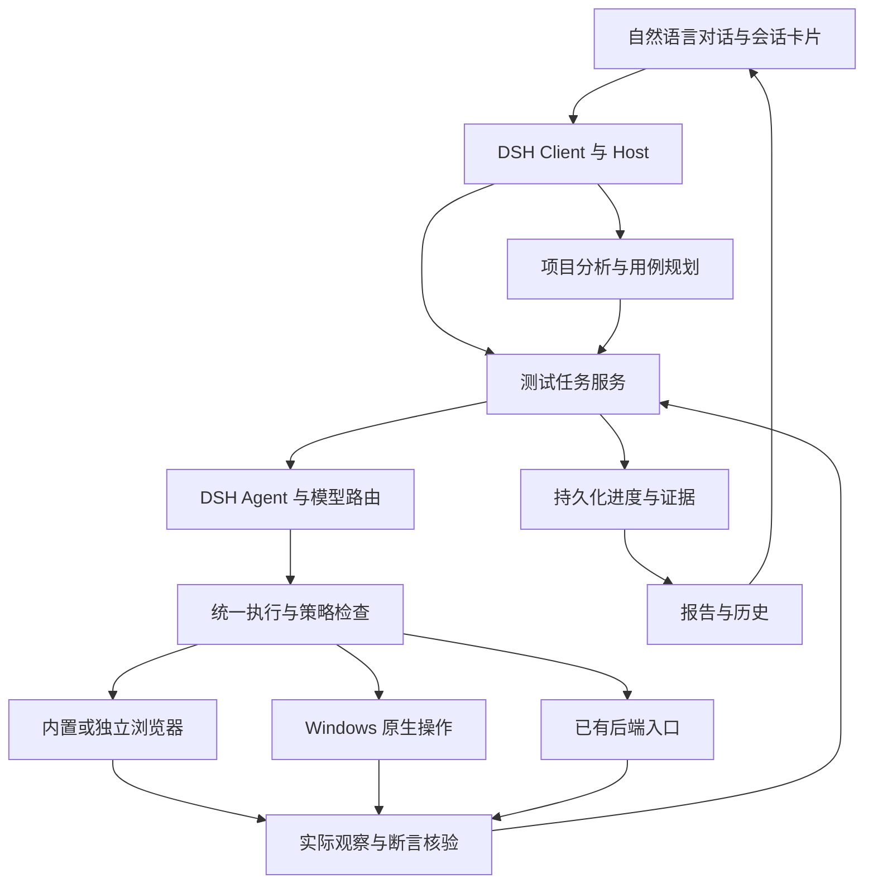

# Agent Note: 技术架构

Status: proposed

[English](2026-09-28-web-testing-architecture.md) | 中文

## 问题

测试应用需要增加自身领域行为，同时保留官方桌面、agent loop、配置和升级方式。

## 提案

[可安装插件计划](2026-10-04-web-testing-installable-plugin-plan.zh.md)负责新选定的交付路线：在未修改的 DSH 中安装一个外部 bundle，使用专用测试预设，首期采用独立 Chrome／Edge。它局部替代本提案的应用级装配和私有桌面集成，业务要求与原有证据继续保留。

状态：产品设计提案；分项探针和原型工作不代表最终实现或验收通过。产品约束来自[产品需求 R01–R58](../feature/2026-09-28-web-testing-requirements.zh.md)；结果字段以[用例与报告规格](../feature/2026-09-28-web-testing-test-case-report-spec.zh.md)为准；交付依据为[验收标准](../testing/2026-09-28-web-testing-acceptance.zh.md)。基座及上游差异统一由[基座与上游升级](../process/2026-09-28-web-testing-upstream-baseline.zh.md)维护。文中的测试服务、操作和实体为本应用拟新增设计，不表示 DSH 已提供这些接口。

首版平台为 Windows 10 22H2（build 19045）及以上、x64；ARM64 和手机实机延后。项目接入不按编程语言或框架限制。用户提供完整代码并启动被测应用；本工具测试、分析和报告，所有执行路径均遵守被测源码、配置及依赖只读。

详细设计阅读入口：[接口与执行 DD01–DD05](2026-09-28-web-testing-design-execution.zh.md)、[数据与恢复 DD06–DD09](2026-09-28-web-testing-design-recovery.zh.md)、[模型与发行 DD10–DD13](2026-09-28-web-testing-design-models-release.zh.md)。这些文件规定具体接口、字段、所有者、提交顺序和验证场景；本文继续维护总体职责，不复制详细 schema。用户已确认 C01：当前 Windows 账户下采用应用层受控操作，不能确定源码安全的动作阻塞，不承诺操作系统级隔离。

**TD01：底座与模块职责**

沿用官方 Electron 桌面、DSH Host 和 Client，以应用自己的 profile／组合包 装配测试能力。基座固定值、必要官方补丁及依赖清单以[基座与上游升级](../process/2026-09-28-web-testing-upstream-baseline.zh.md)为真源；运行可行性和发行组合须通过 M0–M5。工程保留官方工作区、目录、构建及检查体系，不新建平行桌面框架。使用独立应用标识、DSH 数据根目录、浏览器用户数据目录和更新渠道，避免覆盖官方安装的运行配置。

官方已有窗口、聊天、侧栏布局、快捷键、托盘、隐藏主窗口继续运行和标准退出确认，直接复用并验证；本应用只增加测试入口、业务卡片、目标控制和持久批次状态适配。首次引导、模型提供方编辑及凭证存储优先复用官方组件和服务，由对话引导与卡片承接操作；如组件不能直接嵌入，只补同一服务边界上的薄适配，不另建配置后端，也不把用户流程改成必须离开会话操作独立后台。账户引导或工具启用配置不得放宽本应用的源码只读策略。

逻辑职责如下，不据此强制拆成相同数量的进程或包。

| 部分 | 职责与数据所有权 | 接入方式 |
|---|---|---|
| Desktop | 官方拥有窗口、聊天布局、快捷键、托盘和标准关闭／退出交互；本应用拥有测试目标及批次状态适配。 | 沿用官方启动和生命周期模块，仅补目标控制与持久任务事实接入，不重建桌面壳。 |
| Test Client | 对话中的用例、待处理项、进度、报告和 skill（技能） 差异；读取事实，不决定测试结论。 | Client 会话节点及视图扩展。 |
| Project Analysis | 源码清单、快照、需求依据、页面入口、业务关系、差异和分析缺口。 | DSH 文件读取、检索与模型调用；所有源码读取受同一策略约束。 |
| Test Runtime | 项目、计划、用例版本、批次、依赖、操作意图、等待和恢复的唯一写入者。 | Host 内测试领域服务、模型工具及确定性命令；通过 DSH Agent（智能体） 驱动推理，不替换 agent-loop。 |
| Execution | 浏览器目标、身份会话、原生操作、已有后端入口和异常模拟。 | DSH 工具流水线与统一执行策略；浏览器与电脑各按其能力服务接入。 |
| Verification | 把明确预期与实际观察比较，产生断言结果和缺口；保留判断依据。 | 确定性核验、视觉分析与必要的业务推理，共用批次规则。 |
| Evidence / Report | 证据引用、报告投影、导出与历史关联。 | 复用 DSH 非会话存储和附件服务，不另造通用存储、会话日志或回放引擎。 |
| Model Routing | 任务能力匹配、主备模型、调用记录与故障分类。 | DSH 模型适配器及请求扩展点；优先复用已有 适配器，专有协议才新增适配。 |

DSH 官方架构要求通过 profile、插件、服务和事件扩展；会话日志中的输入必须能重建模型实际看到的内容。新增服务按 Definition、Provider、Consumer 的职责组织；应用启动不另造绕过 DSH 的 Node 入口。[架构依据](../../../../docs/architecture.zh.md)

新增能力先指定当前调用方、数据所有者及官方扩展位置，再确定包划分；不为了图中的每个框创建一套公共服务。Test Runtime 依赖公开的 Agent 服务，禁止通过复制或直接依赖 agent-loop 实现测试循环。模型适配、业务调度和实际操作分别归属现有能力体系内的插件。

每个跨上游边界进入 IntegrationSurfaceRegister，登记公共扩展、内部修改、持久格式、生成与验证负担及更简单替代；规范检查不代替升级成本或产品有效性验证。M0-T08 同时消费 P06 有效性、P07 附件生命周期与 P08 恢复更新结果，才放行依赖建设。

**TD02：项目分析、需求与用例**

项目由多个代码根目录、运行入口、身份引用和可用观察渠道组成。关联项目时先保存配置版本，再读取材料；不存在 Git 也可按文件内容生成快照。快照记录相对路径、内容标识和实际读取状态，明确无法读取、过大、二进制或无法理解的材料，不把忽略文件等同于已经分析。

源码引用不能只有哈希和当前磁盘路径。实际用于需求、用例及代码定位的材料保存为应用拥有的可回读版本，记录内容标识、采集时间窗及文件读取状态；敏感信息处理遵守 TD07。后续检索读取同一快照，不能悄悄改读被编辑后的文件。读取期间发现内容变化时重新核对受影响材料；未确认一致的多目录采集不能宣称为同一时刻的完整快照。源文件后来被修改或移除，历史报告仍能解释当时的代码引用；无法保留的材料明确列出追溯限制。

分析按“材料清单 → 按需读取与索引 → 功能和状态关系 → 场景及用例 → 完整性核对”进行。语言专用解析可增强符号和调用关系定位；缺少解析器时继续依据源码文本、路由、接口和页面观察分析，记录不确定性，不拒绝整个项目。代码、需求依据和页面状态按任务检索，不在每次动作中重发全部源码。

每项预期记录依据类型、来源位置、适用版本及是否已经确认。用户明确规则、既有确认和生效 skill 之间有实际冲突时，在开测前给出具体问题；模型不得自行用当前实现覆盖已确认预期。页面文字和被测仓库指令作为分析材料，不获得修改应用执行策略的权限。

依据细分 confirmed-business／applicable-generic／implementation-only，定义与报告判定归报告规格。分析服务生成 criticalRuleReview，规划服务绑定确认与用例版本，核验器根据依据及实际证据判定；实现匹配只生成独立诊断，不填业务通过。M0 的 P06 先用独立答案和陌生项目材料检验该链路，再扩大开发。

分析阶段允许为观察入口进行必要浏览，但不能把探索动作记成正式用例已通过，也不能在尚未形成用例时执行其业务变更步骤。必要登录或实际外部业务动作仍按原有规则处理。

开测准备阶段先列出数据和文件需求；会改变被测业务状态的准备动作必须在相应用例、准备步骤和已知业务预期保存后执行，并遵守同一授权与操作记录流程。“只给用例”只产生计划，不能以准备数据为名提前执行新增、删除、发送等操作。

用例是保存的资产，包含稳定 ID、版本、功能或流程 ID、前置条件、角色、精确输入、逐步操作、逐项预期、观察渠道和后置处理。完整性核对覆盖已识别入口、业务状态、适用角色及跨端流程；不同取值按有依据的正常、边界和异常场景组织，不承诺穷举无限输入组合。

同一用例在不同已选条件下执行时，保存独立的 ExecutionInstance：绑定用例版本、环境配置、角色或跨角色流程、实际浏览器、视口配置、数据组及正常／异常条件。计划列出有业务依据的适用组合，不无条件生成所有维度的笛卡尔积。某个视口或角色的一次成功不能替代其他计划内实例；复试属于原实例下的新 Attempt，不增加覆盖分母。实例和断言的统计口径由报告规格定义。

新增版本先与选定基线比较，形成新增、预期变更、操作变更、移除和间接受影响清单；业务预期变化确认后保存用例新版本。执行中发现预期明确的新功能，先增补计划再执行；新的业务疑问按 R28 跳过并入报告。保留原始计划和每次增补依据，统计当前分母。

动态发现按业务能力、适用角色和状态识别；分页中的不同记录 ID 不自动产生不同功能。重复发现只追加依据，防止同一入口被无限增补；实际新增状态仍须入计划，不能用发现数量上限静默删去必测范围。用户明确改变范围时保存 PlanRevision 与原因，报告同时保留原范围、当前范围和移出项；条件缺失或执行失败不构成自动缩小范围的理由。

**TD03：核心记录与持久化**

所选基座的 Session writer 为 V4；测试领域 schema 与 Session 格式各有权威，不将两者共用一个版本号。会话消息按新标签构造器及 developer／tool 结构处理，历史读取采用当前异步接口；旧 V3 材料只能通过官方支持的迁移流程核验，不能就地改头或覆盖原代际。

| 记录 | 关键内容与关系 |
|---|---|
| Project / ProjectRevision | 代码根目录、入口、角色和凭证引用、视口、日志及数据库观察渠道。 |
| SourceSnapshot / RuntimeIdentity | 各模块源码快照、入口运行版本、核实依据及未知状态。 |
| Requirement / Feature | 功能、场景及业务预期来源，关联代码和页面证据。 |
| CaseVersion / PlanRevision | 不可覆盖的用例内容与每版计划成员；引用生效规则和 skill 版本。 |
| ExecutionInstance | 一版用例在一组适用执行条件下的实例；计划内唯一，关联其全部 Attempt 和断言。 |
| CatalogHead / ProjectHead / SkillHead | 首次创建与资源发布、稳定资源 ID、各实体活动修订和命令回执；界面列表不是登记权威。 |
| RunHead / StepCursor | 批次阶段与状态、已提交引用、恢复位置、在途操作、等待及通知；步骤修订和已消费动作槽位。 |
| Attempt / ActionRecord | 用例尝试、动作意图、操作标识、目标代次、发送和观察状态、恢复核验结果。 |
| AssertionResult / EvidenceManifest | 每项断言结论及原因、证据引用、完整性和采集条件。 |
| Question / ActionAuthorization | 业务疑问或必要操作确认、答案及适用范围；超出范围的后续动作不能复用。 |
| DataLedger | 本轮创建、修改、删除、依赖、保留及清理记录；不假定已有数据可撤销。 |
| Issue / Disposition / RetestLink | 缺陷及各次观察、用户处置、补测和回归关联。 |
| SkillRevision / ReportRevision | skill 草案和生效历史；从同一批次事实生成的报告版本及证据清单。 |

测试领域资产通过 DSH storage domain 访问，SQLite 为候选 后端；产品服务不直接访问 后端、数据库文件或自建 JSONL 日志。单次领域写入的原子性不等于跨领域或跨记录事务。[存储依据](../../../../docs/subsystems/storage.zh.md)

每类事实只指定一个权威来源：项目、用例、批次和断言属于测试领域；模型实际输入输出、工具执行及会话交互属于 DSH Session；二进制对象属于附件服务。领域记录引用必要的 Session 事件和附件，不复制一套通用模型轨迹。报告从领域提交结果派生，聊天进度是通知投影，不能倒写成为批次结果。

批次由唯一活动写入者提交：先经领域存储保存不可变的 Attempt、ActionRecord 和 AssertionResult 等业务记录，并经附件服务保存证据；确认持久化后，单次更新 RunHead 的修订号、记录引用、恢复位置和待投递通知。只有该头记录引用的业务修订进入批次结果；提交前的孤立记录不算完成。历史通过有界的版本记录引用读取，避免头记录无限增长；这套提交设计只处理测试业务，不替代 Session 的追加与回放规则。写入者所有权覆盖恢复和重连，不能依赖单个服务实例中的内存队列防止两个 Host 同时写同一批次。

同一批次串行处理带稳定 commandId 的命令。重复请求返回已有提交结果，不重复创建计划、派发业务操作或增加覆盖数；不能据此推定目标系统具有幂等能力。跨项目索引、历史列表和统计是可重建投影，不能反过来作为恢复依据。权威记录损坏或格式不兼容必须显式失败，不能跳过坏记录后把剩余历史当成完整结果。

首次创建资源先登记意图及预留 ID，再建立实体头并发布入口；提交协议见 DD06–DD07。大附件及模型等待在业务提交队列外，入队后重新核验版本。控制根使用跨登录会话且不随数据代际变化的独占锁，不能只靠 UI 单实例或数据路径字符串区分写入者。

批次提交和 Session 追加不是同一事务。RunHead 的待投递项只协调业务通知，提交后通过已注册的 Session 事件写入关联会话；deliveryId 使重投可以被识别，投影和送入模型的通知需按 ID 去重，不能只在 Client 隐藏重复卡片。Session 保留实际追加事实；所有进入模型请求的内容须可由其日志及持久引用重建。提交已完成但通知未送达时只补投通知，不重新执行目标业务。通知事件类型和去重投影须按官方会话扩展规则定义，具体记录接口列入 I02。

截图、附件和录像通过 `ctx.attachments` 的受支持接口持久化后才发布引用；AttachmentId 作为不透明标识使用，不解析其编码或拼接底层路径。报告所需原始图片以保留原字节的文件附件保存，模型使用的规范化图片另存引用并记录与原件的关系，不能把模型缩图冒充原始证据。原始大文件使用支持流式文件存储的 提供方，能力不满足时明确报错。共享附件的清理必须核对所有仍保留的引用，不能删除一个批次就直接删除底层对象。[附件依据](../../../../docs/subsystems/attachment.zh.md)

文件写入中断、头提交失败、会话通知中断和损坏材料均有独立验收场景。持久化无法确认时暂停派发新的业务变更动作；不能一边丢失记录一边继续测试，再补写“成功”。

存储空间策略与资产清理见 DD09：默认不设硬配额，仍监测实际写入卷并在必要证据无法保存前阻止新动作；用户确认的本地资产清理与 R33 的业务数据清理分别记账。当前基线、活动任务和共享证据引用不能由清理器自行解除。

**TD04：批次状态与恢复**

批次 phase 记录分析、用例确认、执行、报告生成、数据清理等业务阶段；status 记录待执行、执行中、恢复中、等待用户、等待业务时间、已暂停、封存待恢复、已结束、已取消。用例和断言结果继续使用报告规格中的分类，不能用批次状态代替通过或失败。

| 触发 | 状态处理 | 下一步 |
|---|---|---|
| 开测前存在业务疑问 | 等待用户，保存问题与影响用例。 | 答案落实到用例后执行，不按默认选项推定回答。 |
| 临时模型服务失败 | 恢复中，保存下次尝试与故障类别。 | 自动恢复、必要时切换适合的已配置备用路由。 |
| 执行中新业务疑问 | 受影响项待确认或跳过，独立用例继续。 | 本轮报告集中列出，回答后新版本用例补测。 |
| 必须扫码、验证码或真实外部动作确认 | 相关步骤等待用户；其余独立用例可执行。 | 用户回应后核对页面及授权范围。 |
| 等待到期或异步业务时间 | 等待业务时间，保存时间窗。 | 到时核验；无需维持高频模型调用。 |
| 用户暂停 | 立即关闭本地派发门，再保存暂停决定；在途结果单独保留。 | 不等待模型或目标服务器返回才禁止新派发；控制是否持久保存分别显示，仅收到继续指令后恢复。 |
| 用户取消 | 立即关闭本地派发门，再保存取消决定；保留已发生或结果未知的操作。 | 不等待在途操作核实才禁止新派发，不自动重启，不承诺撤销业务变更；未保存不能假称跨重启生效。 |
| 关闭主窗口 | 只改变界面状态，不结束批次。 | Host 及必要浏览器资源继续存在。 |
| 明确退出或崩溃后重开 | 检查原状态和恢复标记。 | 对非主动暂停、非取消且未封存的任务核对环境后自动续跑；封存批次走 DD12 的只读核实和关联续测。 |

恢复以动作事实为粒度。执行顺序为“持久化操作意图 → 重新确认目标与前置条件 → 标记发送中 → 派发动作 → 观察结果 → 提交结果”。若进程在发送中或结果保存前消失，该操作的结果为不明确，恢复时先用页面、业务记录或已有观察渠道核验。能确认已成功则继续后续步骤；确认未发生且条件仍满足才允许重做；无法确认时保持受影响步骤待核验，不盲目重复提交。

待核验不等于允许无限重复查询。仍有可用观察渠道和有效业务等待条件时继续核验；已确认没有进一步核验条件时，将该实例列为阻塞，保留结果未知的动作及补测条件，继续独立实例。批次可以按覆盖不完整规则结束，但不能把未知动作改成未发生，也不能在后续补测中跳过原动作核对。临时模型或观察服务故障仍按恢复规则处理，不能伪装为永久缺失以提前结束。

operationId 用于本工具内部去重，不假定目标系统理解它或提供幂等接口。真正具有幂等支持的已有入口可以复用其机制；取消模型请求、超时或断开浏览器均不能撤销已经送达的操作。

operationId 由 Runtime 依据实例、Attempt、步骤及该步骤内的动作序号分配并持久化，模型重新规划或重发工具调用不能用一个新 ID 绕过尚未结算的原动作。真正的业务复试须先核对原动作并建立符合复试策略的新 Attempt；连续输入等步骤内本就需要的多个动作分别记账。恢复、暂停、取消或用户接管使旧的派发许可失效；执行器在实际派发点核对批次状态、写入者与目标代次。迟到的模型结果不能继续派发，已发出动作的迟到回执可以追加事实，但不能把已暂停、已取消或封存待恢复的任务自动改回执行中。

DD06 的步骤修订和动作槽位也防止已结算动作被旧请求再次执行。DD07 分开交付状态与业务结果；暂时查不到记录不能证明原请求不会稍后生效。暂停／取消立即关闭派发门，持久化控制决定另记结果；存储卡顿或失败时明确显示未保存，不能假称跨重启已有保证。

DSH 默认 Job 和 Browser Use 生命周期不直接保证上述恢复；批次状态独立于活动 Agent，活动执行会话通过批次记录重新建立。普通对话与测试执行会话以稳定 runId 关联，切换聊天不取消测试。Job 只承载其适合的活动工作。[Jobs](../../../../docs/subsystems/jobs.zh.md)、[Browser Use](../../../../docs/subsystems/browser-use.zh.md)

官方 Schedule 只可作为按需装配的辅助唤醒入口，不负责测试进度和动作完成判定，不为 API 重试另建一套日程任务。RunHead、retryAt、操作槽位、启动扫描及暂停／取消记录是业务权威；唤醒先去重，再检查当前状态。退出与更新检查必须汇总所有持久批次，包括没有活跃 Agent 的等待、暂停、待恢复和封存批次，不能仅看官方 live Agent／Job 列表。

工具调度失败的会话续跑与业务恢复分别验收。所选基座已包含上游 #4595 的实时缺失工具结果补齐；撤去重复本地回移，复验实际应用组合。M0 仍须验证部分完成、调度失败、取消及续跑的消息配对。工具结果 UNKNOWN 保留动作核实义务，不能因为对话恢复成功就重发业务动作，协议映射见 DD08。

活动 Agent 通过 `ctx.agents.create()` 或 `ctx.agents.resume()` 获得，由创建或恢复它的调用方负责释放；恢复后重新取得有效句柄，不保存旧 Agent 对象供重启后调用。业务调度使用公开的 `send`、`followup` 或 `inject`，按其空闲／运行语义选择，不修改 DSH 的 AgentStatus。`followup` 入队不代表一次测试完成，`whenIdle()` 也不能单独证明某个批次结束；完成依据是所属 runId 的业务提交和全部待推进项。恢复普通会话、查看报告或网关解析冷 Session 身份，不构成解除用户暂停的指令。[Agent 接口依据](../../../../docs/subsystems/core.zh.md)

R57 的阶段进展检查点和有限恢复规则由 DD08 维护；正常业务时间、模型退避及用户等待不算任务空转。反复重规划、重复观察不能单靠记录数量增加重置停滞判断。停滞等待保持任务和证据，独立实例继续，不引入累计调用或费用停止条件。

**TD05：浏览器、角色与电脑控制**

内置浏览器由 P01 同等比较官方 webview 与 WebContentsView 后决定，接目标 webContents.debugger/CDP 和受控 TargetBroker。比较能力、隔离、生命周期及上游维护成本，不预设复用胜出。统一 提供方 管理目标和身份，模型不另建控制连接；官方面板的 CWD 共享分区、临时 Cookie、下载／弹窗限制不能直接作为测试配置。详见 DD02 与 BrowserCarrierDecision。[官方浏览器](../../../../packages/client/ui-sidebar-browser/README.zh.md)

统一入口实现为官方 Browser Use 能力下的 提供方，每个组合只注册一个；共享注册服务不持有跨会话活动浏览器。内置与应用管理的独立浏览器由该 提供方 的目标实现协调，不通过并挂多个 提供方 争抢同一页面。需要的目标元数据放在拥有执行资源的实现中；不得引入另一套与官方会话所有权相冲突的全局浏览器管理服务。恢复时重新建立目标、核验登录和页面，不能把 Session 回放当成恢复了浏览器内存。

被测 WebContents 与 DSH 对话界面分开承载，使用隔离的浏览器 Session；被测内容不加载聊天界面的特权 preload，也不获得 Host 凭证、Electron IPC 或本地控制接口。明确禁用 Node integration，启用 contextIsolation 和 renderer sandbox，保持 webSecurity。主框架、子框架、新窗口、权限申请和协议跳转均按目标归属处理；普通项目弹窗和跨域登录由受控目标承接，不能一律禁用后声称已覆盖，也不能全局关闭隔离来兼容页面。Host 的实际调用入口继续检查调用来源和凭证，不能仅依赖浏览器同源限制。[Electron 隔离要求](https://www.electronjs.org/docs/latest/tutorial/security)

项目、环境和角色的身份上下文隔离 Cookie、站点存储及 Service Worker 等状态；同一角色跨入口流程是否共享身份按用例明确。同一业务要求中的正常登录流程不被不必要地拆断，两个不同角色也不能只靠 targetId 区分却共用登录存储。首次干净环境与历史登录／缓存兼容分别绑定可追溯的上下文，不能每次都清空后宣称验证了旧状态；独立浏览器同样使用应用管理的 profile。[Session 与 partition](https://www.electronjs.org/docs/latest/api/session)

每个目标记录 projectId、runId、roleId、browserInstanceId、targetId、frameId、navigationGeneration 和有效视口。导航、重建或角色状态改变后，旧观察和元素引用失效。模型候选动作必须携带观察标识，执行前再次核对目标身份和必要状态；不能根据另一角色页面或陈旧截图点击。

同一 URL 下的局部重渲染也可能使目标过期。动作前核对的是目标元素及本步骤依赖的页面状态，不能只比较导航代次，也不因无关时钟文字变化就无限重新观察。输入、导航和提交后的核验按用例中的实际状态条件等待，不能统一睡眠固定时长后截图。明确业务时限被违反可以形成失败；没有可靠时限或观察渠道时记录等待、执行问题或疑问，不能由模型任意超时判定产品有缺陷。

定位顺序优先语义及可核对的页面结构，必要时使用截图和坐标。动作方式由用例目的决定：测试 Enter、换行、焦点和中文输入法时实际执行对应行为；直接写 DOM、调用接口或粘贴文本不能代替这些验证。复杂 iframe、Shadow DOM、Canvas、富文本、拖拽、弹窗和多窗口都有明确的能力验收，不能套用简化浏览器示例的限制作为产品范围。

同一流程的多个角色使用各自会话，围绕同一业务标识联动。一个批次的浏览器执行会话拥有相关目标，角色不等同于多个相互抢占浏览器的 DSH Agent。需要验证共同编辑等场景时，调度用例内的多个角色动作并记录先后及重叠条件；不是给多个执行者自由争抢页面。

DD02 明确 SessionResources 的同 Agent 串行边界：计划内并发由一次 run 回调拥有的执行组协调，不嵌套调用队列。独立批次／活动代次使用不同可写身份上下文；历史 ProfileRevision 经受控导入，不直接共享活动目录。子资源请求与导航一样不能取得宿主控制面能力。

共享环境且共享业务数据的独立批次默认排队。原生鼠标键盘对一次完整的观察、操作及核验过程授予排他控制；明确操作目标窗口及其进程，焦点或窗口归属变化时停止派发并重新观察。用户接管先撤回自动派发，归还后重建观察。DSH Computer Use 本身不自动提供跨会话桌面预约，本应用必须承担协调。[电脑控制依据](../../../../docs/subsystems/computer-use.zh.md)

主聊天窗口关闭时保留测试页面资源；需要原生交互时使用应用拥有的可见测试窗口。锁屏、休眠或必要前台条件不满足时保留等待状态，不能承诺系统输入仍可后台完成。恢复焦点后核验目标、视口和在途操作，不把窗口隐藏解释为任务取消。

用户指定的网页视口独立于聊天布局；窗口变窄时可以裁切或缩放预览，但预览缩放不改变测试环境或产生新的测试覆盖。实际布局视口由受控页面配置并读取核对，原生操作另记录 Windows DPI 和坐标变换。无法实现指定条件时明确报告，不能以图片尺寸冒充。

第三方登录或浏览器特有流程需要时使用应用管理的独立 Chrome／Edge，必要时整条相关流程在该身份会话中完成。保持统一用例和证据格式，记录真实浏览器环境，不假定外部登录状态会自动传回内置页。CDP 与原生 Playwright 连接的能力差异保留为适配验证点。[CDP 说明](https://playwright.dev/docs/api/class-browsertype#browser-type-connect-over-cdp)

**TD06：模型路由与可替换的轻量决策模型**

| 任务 | 默认设计路径 | 必须保留的核验 |
|---|---|---|
| 文件检索、差异、精确值及统计 | 确定性程序。 | 范围、原始值和计算依据。 |
| 需求、用例、依赖及复杂业务推理 | 能力适合的文本推理模型。 | 依据和不确定性，不能自动确认未知预期。 |
| 已明确步骤，且页面前置条件匹配 | 执行器直接执行保存的步骤。 | 每次仍有实际动作与结果核验，不能重用旧报告充数。 |
| 从当前有限候选中选择动作和目标 | 按 RouteBenefitDecision 使用合格的确定性、通用或轻量路线。 | 新观察、目标有效性、动作前置与实际收益；轻量能力接通不等于默认启用。 |
| 普通业务文本生成 | 合适的小型文本模型或确定性数据生成。 | 用例指定的空白、换行和边界文本不可改写。 |
| 页面视觉、复杂位置与异常解释 | 视觉模型和必要的文本推理。 | 原图、实际布局事实、明确预期；疑问单独记录。 |

轻量结构化决策模型用于从有限候选选择动作／目标、识别页面状态等局部任务。能力描述独立记录支持的模态、语言、决策类型和输出约束；并非这类模型都支持图片、通用聊天或某品牌的评分原语。它不接管整套业务规划、不直接操作浏览器，不根据 DONE 或高置信度判定用例通过。模型不绑定品牌，适配规则见 DD10。

本应用新增模型请求统一经过 ctx.llm 与注册 LlmAdapter，浏览器和 Runtime 不直连提供方 SDK。公共 DecisionRequest／DecisionResult 定义任务所需的候选、观察、结果及可选置信语义；已有 适配器 可用时复用并增加领域校验，专有协议确实无法表达时才新建 适配器。不向 DSH 核心增加自定义消息类型。I04 仍需真实提供方证据。[模型归属](../../../../packages/llm/README.zh.md)、[适配要求](../../../../docs/cookbook/adding-an-llm-adapter.zh.md)

unsupported 能力在调用前拒绝并转交合适路由，不能静默丢弃图片等输入。直接使用 `ctx.llm.stream` 的结构化决策仍须先记录实际输入，并记录输出与用量；它不自动继承 Agent 步骤的重试和会话记录。本应用为这种调用指定一个拥有取消、结算和恢复责任的调用方，避免 SDK、Agent 和批次各自执行相同重试。

轻量模型选择不合法目标、低于经验证的阈值、状态过期或反复无进展时，先重新观察或转给能力更适合的已配置模型。阈值和退避参数属于显式配置，不能直接把一个任意置信度当成通用正确性标准。中文标签、原始输入和业务值保持原样；语言表现通过代表性场景验证，不通过修改测试数据追求成功。

模型故障与业务失败分别处理：临时限流、超时及服务故障自动退避并可继续恢复；凭证无效或不可修复的请求配置进入待处理状态，保留批次；不因累计费用停止。执行中只接受已经完整记录并验证的决策，流式半条输出不触发业务动作。

DSH 原生 retry 支持活动 Agent 步骤重试，直接 stream 调用仍是单次；其 always 模式也可能反复请求永久错误。因此不能仅开启 always 视为本需求完成：本应用需要在兼容扩展点对故障分类、状态持久化和备用路由进行协调，并避免 SDK 与上层同时重复重试造成不可控放大。[重试机制](../../../../packages/llm/llm-retry/README.zh.md)

首选策略为原生 normal 模式承担一次活动步骤内的短重试；短重试耗尽后，仍可恢复的故障交回批次服务，持久化下次尝试并经 DSH 支持的续跑入口安排活动执行，直到成功、需要用户处理或用户停止。短重试次数不是整批次重试上限。业务执行的模型请求优先留在 Agent 步骤内；若专门的类型化决策必须使用直接调用，其独立请求必须由同一批次恢复策略管理，不能假定原生 retry 已自动覆盖。

R56 的首次模型配置复用 DSH 配置／凭证能力，经对话卡片完成连接与能力核验，具体流程见 DD05、DD11。轻量决策路线可稍后配置；缺少任务必需能力时明确等待配置，不把不可执行任务标为已就绪。凭证管理、任务影响与路由版本记录分开处理。

toolUpdate 等模型能力声明不等于已证明缓存或性能收益；声明、实际协议支持和同条件实测分开记录。对照包含缓存、复核、失败重试与恢复的总成本。图片失效只修复相应 适配器 的模型输入资源，不重放已经派发的业务动作；多图同时失效属于 V10 的适用验证，详见 DD11。

**TD07：只读执行与真实外部操作**

统一执行检查接收动作类别、项目和批次、目标、参数、预期影响及有效授权引用，再决定是否允许派发。检查必须位于真正执行文件写入、命令启动和桌面输入的服务内，不能只在 UI 隐藏按钮或在工具清单中省略名称。普通对话和测试共用相同规则。

工具在对话运行中动态启用、首次引导修改工具配置、自动审查拒绝后请求人工同意，都不得解除源码只读等绝对禁止条件。能力目录变化后重验实际执行入口，已加载和新加载工具遵守同一 guard／执行策略；普通人工审批只决定允许范围内的业务动作。

模型工具在 Agent 的 scoped Context 上用 `ctx.tools.restrict()` 约束实际可用能力；使用 `ctx.tools.guard()` 表达不可被后续同意覆盖的禁止条件。需要询问的动作走 `tools/pre-execute` 和官方 `ctx.approval`，执行生命周期扩展使用 `tools/execute`，审计读取最终 `tools/result`；绕过工具的内部调用仍由实际执行服务检查。PTC 的 `run_code` 和其子调用遵守官方工具流水线；限制最终能力工具，不能把保留的 PTC 传输工具名称放进禁止清单冒充策略完整。[扩展位置](../../../../docs/cookbook/extension-cookbook.zh.md)、[工具流水线](../../../../docs/tool-execution-pipeline.zh.md)

源码根目录作为读取材料；应用配置、skill、报告、生成的测试文件和证据写入应用拥有的位置。写入按最终文件对象和受控目录判断，不能仅比较未经规范化的路径字符串。文件复制、重命名、链接、保存对话框和生成脚本等路径同样纳入只读验收。应用不会为了测试或源码分析安装被测项目依赖、修改配置、运行迁移或执行修复命令。

模型不获得不受约束的通用 shell 和任意文件写入入口。读取、检索、生成测试文件及报告采用明确操作；没有页面入口的后端命令通过专门执行服务接收已核对的可执行项和结构化参数，限定工作目录、输入输出及文件效果，不能只因命令在仓库中存在便运行。服务不能满足源码只读条件时拒绝该执行路径并记录能力缺口，禁止自动转为无限制 shell 重试。

DSH 的 Windows ACL 沙箱明确报告 partial enforcement，存在环境 ACL 和链接等限制，不能单独证明系统级源码隔离。用户已确认 C01：使用当前 Windows 账户，首版通过受控工具、目标及路径约束保护源码，禁止任意终端、代码编辑器及不受限制的桌面控制；无法确定文件效果的操作阻塞，不自动放宽限制。I03 验证本工具所有受支持路径的实际拒绝行为，不声称对任意同账户程序或执行器漏洞具有操作系统级保护。具体机制与剩余风险见 DD03，分项原生探针不代表所有受支持路径的保护已验收。[沙箱约束](../../../../docs/subsystems/sandbox.zh.md)

电脑控制服务仅对测试所需的受控窗口和明确操作派发输入；拒绝借运行对话框、编辑器、终端或不受控窗口绕过源码只读。文件选择和另存为使用生成材料及允许输出目录。桌面目标变化或操作归属不明确时重新核验，不把坐标落点预测当成已经确认的窗口所有权。

登录与模型凭证使用官方凭证或应用受保护的凭证引用，不进入普通用例正文和导出材料。只读数据库核验依赖真正限制写入的账号及适合的连接能力，不能只用 SQL 是否以 SELECT 开头判断。原始运行材料、最小化的模型输入和对外导出分别处理；脱敏后的模型输入仍须能从会话日志重建，证据不能在脱敏时丢失必要复现语义。

应用须默认不采集产品使用统计。所选 desktop 基座已包含统计与遥测；本应用首启前禁用及导出端／队列验证由 [DD12](2026-09-28-web-testing-design-models-release.zh.md)维护。Session 反馈、模型请求和被测业务网络仍各自遵守其配置与材料规则，不能以一个统计开关代表全部外发通道。

支付、短信、邮件的确认针对业务影响，包括普通“提交”按钮下游可能触发的外部动作。记录服务、操作、收件人或业务对象、次数及适用步骤等具体范围；范围已明确时复用授权，超范围不得重用。无真实服务按既定规则跳过对应流程；不能改成模拟发送后宣称真实服务通过。测试环境中的普通业务 CRUD 继续使用已有授权。

外部服务状态区分已确认可用、已确认缺失和未知；不能从本地没有密钥或没有观察到请求推断“无真实服务”。已识别有外部影响但环境状态或授权范围未知的动作在派发前等待必要确认。授权绑定具体项目和环境，环境、对象或影响范围变化后重新核对；结果不明确的在途动作继续占用已授予的次数范围，先查明结果，不能因重试就假定未发送并再次消耗一次真实操作。

ActionAuthorization 保存的是用户确认的业务范围，决定某次动作是否仍需询问；真正需要询问时使用 DSH 的一次性 approval 流程，不新建通用权限系统。业务预期疑问沿用会话交互能力，不能伪装成操作授权；即使取得操作同意，源码写入等禁止条件仍不可绕过。

R54 的环境声明和数据范围在正式执行／业务准备前确认，按入口与相关配置版本保存；生产或未知环境的变更及有影响的故障模拟须有明确流程授权。EnvironmentDeclaration 不是技术认证，ActionAuthorization 的 environment-action 与 external-service 分别校验，不能相互替代；环境变化后重新核对。授权不足保留覆盖缺口，详细规则见 DD04。

**TD08：核验、异常模拟与专项**

每个必测断言明确对象、期望、观察渠道和成立条件。存在可精确比较的数据时采用确定性比较；需要页面视觉或业务解释时，模型给出引用证据的判断，预期不清转待确认。需求规划与结果核验使用不同职责和明确输入，不让执行模型为了完成任务自行改写预期；不同职责不强制使用不同厂商模型。

视觉核验记录实际视口、缩放、DPR、加载状态、滚动位置和测试数据，结合截图及布局观察检测重叠、遮挡、溢出、截断、焦点和交互可达性。历史截图仅作为已明确版本的参考；动态图表、时间文字等差异需有记录的处理规则，不随意屏蔽疑似缺陷区域。首次页面没有设计稿时，客观异常可以成缺陷，单纯偏好或无法确定的变化作为疑问。

异常模拟由 Execution 持有作用域和恢复记录，指定受影响页面、请求、异常阶段、开始与结束条件。先确认注入生效，再观察异常期间与解除后的行为；模拟规则在页面重建、取消和异常恢复时重新核对，避免遗留规则影响其他用例或模型连接。浏览器端失败响应只证明该条件下的页面处理，真实后端故障和恢复需要各自证据。

性能压测和安全专项按 R11 选择，初始目录作为设计提案，在具体项目生成专项计划时明确目标和参数：

| 专项 | 首版设计覆盖 | 执行前需要明确 |
|---|---|---|
| 性能与负载 | 页面与关键操作耗时、错误率；选定已有接口的受控并发、逐步负载和恢复观察。 | 目标入口、并发或到达率、时长、数据准备、阈值及停止条件；如无业务阈值只能报告测量，不能自行判定达标。 |
| 安全专项 | 登录与会话、角色及对象访问控制、输入与输出处理、敏感信息暴露等有证据的检查。 | 具体场景、允许作用的测试环境、可用账号和影响范围，真实外部动作仍遵守 R25。 |

专项必须有实际执行器、观测和结果，不能仅生成建议报告。目录不宣称覆盖全部安全缺陷类别或全部容量极限；普通角色可见性、输入边界及异常恢复仍属于已确认的日常功能测试，不因专项未选择而遗漏。

**TD09：业务数据、后端和跨时间流程**

数据准备和正式断言分别记账。准备记录或附件成功只证明前置条件成立；正式页面流程仍实际执行。记录新建实体及其跨入口关联标识，核验文件导入和导出实际内容，包括适用字段、记录数、精确值和换行。已有数据的修改、删除保留前后观察和操作记录，不能用本轮新建数据的清理机制假装恢复。

清理以 DataLedger 中可证明属于本轮的记录为依据，先排除缺陷复现、待补测及必要关联数据，再按依赖关系通过允许的业务入口清理。先保存报告与证据，后记录清理结果；归属或级联影响无法确定时保留并说明。未来历史兼容使用可取得的旧记录、附件及状态，不擅自长期保留所有成功测试的业务数据。

清理前保存的报告标明清理待处理；清理结果形成后，生成关联同一批次的新 ReportRevision，并保留原版本。只有计划内测试、必要等待以及清理都已得到结果或已按既定规则记录无法继续的原因，才能进入批次结束；测试断言完成不等于清理已完成。尚可自动恢复的清理执行保留待推进状态，已取消批次仍按取消规则处理。该设计不要求为了清理重新运行测试，也不把清理失败改写成某条业务用例失败。

暂停或取消同样约束清理阶段：停止派发新的清理动作，核对已发出的操作并保存剩余清单。用户已取消的批次不因自动清理而重新启动业务操作；未清理部分留在记录中，后续可通过明确的清理请求处理。

后端验证通过已有接口或符合 TD07 的已有管理命令触发，记录参数、业务关联 ID、触发结果和最终观察。接口接受、命令退出、队列投递不等于最终业务成功；用日志、只读数据库或后续页面确认适用状态。能从页面触发的功能仍执行页面路径，额外后端证据用于核验及定位。

跨时间用例持久化触发时刻、时区、允许观察窗口、下次核验时刻和已有状态。等待期间释放不必要的桌面控制，继续独立用例。重启后先核对到期时间及可用日志；错过准确触发时刻时区分可验证的最终状态和缺失的时间证据。提前通过已有入口执行处理逻辑，与真实定时调度分别生成结论，不修改系统时钟或项目配置来伪装真实等待。

**TD10：自然语言、报告与 skill**

自然语言请求先解析为明确的项目、批次、范围和动作；已有明确上下文直接执行，不要求每次填表。普通指令涉及多个可能批次时只澄清归属。暂停、取消等明确控制命令可走确定性命令路径；状态查询读取已提交记录，不额外触发测试步骤。

| 用户表达 | 实际状态变化或输出 |
|---|---|
| “完整测试这个项目” | 创建批次，分析材料、生成用例和必要问题；准备完成后执行。 |
| “先给我用例” | 只生成用例与问题，不执行业务变更步骤。 |
| “暂停”“继续”“取消” | 操作所属批次状态；确认在途操作，避免仅回复文字。 |
| “加上保存后刷新检查” | 保存计划新版本和新增用例，保留原执行历史。 |
| “这个是预期行为” | 记录处置与依据，按规则更新用例及关联补测；不删除原观察。 |
| “把经验补进 skill” | 生成具体差异，用户确认后保存新版本。 |

待处理事项只在对应会话中显示，包含原因、所影响步骤和用户需要提供的动作或答案；不新增 OS、短信或邮件提醒。界面切换和查看证据不改变批次生命周期。进度以实际记录为准；完成数量增加必须有对应结果。

Client 通过带稳定业务 ID 的会话节点展示计划、进度、问题和报告，不靠扫描“最近一条消息”猜测归属。重连和历史回放能够重建相同卡片；动态进度不产生另一套互不一致的数据源。[会话节点依据](../../../../docs/subsystems/conversation.zh.md)

Host 业务方法使用 `@Remote` 或 `@RemoteScope`；受支持的流使用 `@Remote({ mode: 'stream' })`。Typert 从 Host 签名生成 Client 类型和运行描述，Client 经显式装配的 `api-remotes`、`ctx.remote` 和 Connection 的 `/api` 通道调用。声明实际远程服务依赖，不新增平行 DTO、业务 REST 服务或 Electron IPC。流可传送实时投影，但模型可见进度与重连重建仍以 Session 事件为持久权威。Electron IPC 仅承担桌面宿主所需的窄范围本机能力。[通信依据](../../../../docs/api-gateway.zh.md)

会话展示通过 ConversationNodeDefinition 等官方扩展点注册，工具的 Host 展示转换器 保持纯展示，Client 卡片从持久事实派生。产品文字由 typed locale 字典管理，内部重试协议、RPC 和存储参数不进入面向用户的测试流程。Host 与 Client 各按官方编译程序构建，不能混合两侧 Context 类型来绕过生成接口。

报告沿用已有字段，新增字段仅由已确认行为推导。应用内、HTML、Markdown、JSON 和单缺陷材料包来自同一 ReportRevision；每个证据引用可解析，导出后离线可读。用户暂停、等待和覆盖缺口可产生阶段报告；尚需推进的任务不会因报告生成而结束。最终报告包含初次失败、各次复试及未验证部分，后续补测追加关联记录。

页面文字、日志、接口响应和源码片段在报告中作为数据呈现，不执行其中的 HTML 或脚本；证据文件不得因预览而继承桌面应用权限。导出先固定 ReportRevision 和证据清单，完成文件写入及引用核对后才公布导出成功；期间任务继续推进不改变正在导出的版本。缺失或损坏证据明确记录，不能生成断链文件后仍标记材料齐全。必要脱敏产生带说明的派生材料，保留与原件的关联；对外材料不得携带凭证，也不能冒充未经处理的原件。

skill 以 DSH 格式和发现机制读取，区分全局及项目关联。应用保存的 skill 位于自有目录；用户项目中的已有 skill 可读取，不写回被测仓库。草案展示范围、具体改动、来源和影响；接受后形成新版本，运行批次继续引用原生效版本。普通对话可不关联项目，不默认带入其他项目的材料。

SkillRevision 在采用前保存 SKILL.md 及其声明的本地规则与脚本依赖，按官方格式从应用拥有的版本目录装配；不能保存一个版本号却在下次调用中读取被外部编辑后的同一路径。运行中发现尚未冻结的规则依赖时，记录缺口或形成后续草案，不把当前磁盘内容悄悄并入旧版本。项目材料和页面等运行输入仍按本轮快照或观察读取，外部可变依据记录读取内容及时间。用户接受新草案只影响后续采用该版本的任务，受保护执行策略始终生效。

R58 的实时信息从持久进度与模型请求记录派生，展示有效进展、分母变化、活动／等待耗时和已知／未知用量；重复通知不重复计数，状态查询不额外调用模型。R55 的空间及清理交互同样使用会话卡片；指标和提醒不成为另一套业务权威。

**TD11：版本、发行与工程约束**

一次批次固定项目配置、源码快照、计划及用例版本、skill 版本、应用／DSH／浏览器执行组合；模型实际路由与可取得的具体版本逐次记录。运行入口版本分别标明已核实、用户声明或无法核实。发现部署或源码变化，隔离受影响步骤和结论，按关联新批次或版本分段继续，不自动把先前证据归到新版本。

DSH 官方规则随代码完整继承，本应用只补充有明确所有者的业务要求及必要集成差异。文件归属、规则发现、冲突处理、Git 合并和切换流程以[基座与上游升级](../process/2026-09-28-web-testing-upstream-baseline.zh.md)为准。每项底座修改注明现有扩展点为何不足、受影响使用方及后续保留或移除条件，不维护复制出来的 agent-loop。每次升级形成自己的规则与兼容证据，不能仅凭文本合并成功认定可用。

历史权威数据迁移需保存可验证备份并在新位置完成转换、检查和切换；失败时保留原数据，不把格式不兼容当空历史。已迁移数据不假定旧版程序可读，自动降级不作为恢复方法。应用自己的存储迁移和 DSH 会话格式迁移分别承担验证。

首版手动更新仍须通过持久化任务资格检查，应用已关闭不代表恢复任务已结束。检查、阻止新任务进入、安装意图和数据代际切换按 DD07、DD12 使用同一稳定控制根协调；不强制取消等待或暂停中的任务换取更新窗口。普通更新与故障恢复更新分别判定；后者按 P08／DD12 独立封存、备份与兼容检查后进入 recovery-only，不要求旧任务先完成。

声明持久化类型发生变化时，遵循官方 persistence-change 检测、确认记录与格式版本规则，同步受影响目录和生成物；不能凭“只是增加字段”跳过审查，也不能给每个新事件任意提升 Session 结构格式版本。已经提交的历史格式代际不移动或覆盖。变更 SessionEventMap 或会话生命周期时，同步评估并更新 TypeScript 与 Python SDK 投影的预期输出。[持久化变更要求](../../../../docs/cookbook/reviewing-persistence-type-changes.zh.md)

开发时读取实际仓库根、改动目录最近的 AGENTS 及其明确引用规则，不复制一份本应用的简化规范替代上游。新增包按官方命名、目录、依赖、导出和编译面配置：服务插件与函数插件不混用导出形式，必需依赖声明 inject，可选依赖用 ctx.get；注册经 effect 管理并可卸载，异步操作有明确生命周期所有者。跨边界 ID 使用品牌类型；事件使用声明合并并记录模式和参数；可调参数由已验证 Config 提供默认解析，不能散落硬编码。静态类型、运行时边界校验及 JSDoc 按所属规则执行。

Windows 验证针对首版 x64，记录具体系统版本、构建号、依赖与显示配置；WSL、Wine 或仅开发机源码启动不能替代原生 Windows 安装及构建产物的验证。项目自身工程验收的具体要求集中在 G01–G16，不在此复制完整官方检查清单。

官方要求产品可见插件经过真实 Loader 组合验证，执行约束在实际执行者生效，提交后才发布状态。具体检查命令和范围由实际改动及所选版本规则决定。[包级规则](../../../../packages/AGENTS.md)、[根规则](../../../../AGENTS.md)

**TD12：设计决策与实现后的验证**

下表定义设计项的验收关闭条件；确认技术选择不等于验证通过。历史探针不代表最终实现已验收关闭。

前置探查、依赖顺序、F1–F6 材料排期和资源预算冻结由[实施与验证计划](../process/2026-09-28-web-testing-milestones.zh.md)维护。M0 仍未通过；历史 P02 选择简单布局，冻结预算前须在所选基座核对其测量和适用输入。分段／检查点仍是需实测收益支持的可选方案，不是先行建设前置。

| 编号 | 设计归属 | 实现后的关闭证据 |
|---|---|---|
| I01 | DD01–DD02 已规定统一浏览器、目标与身份隔离、执行组及双路线能力矩阵候选。 | AC35、AC40、AC42、AC52 及 V01–V03 通过；矩阵在实际组合逐项有证据，复杂交互未验证不计交付。 |
| I02 | DD06–DD09 已规定创建、恢复、控制、空间、资产、停滞和指标；分段及检查点等待 M0 验证必要性。 | 恢复矩阵及 G07、G08、V04–V07、V12、V16、V18 通过；R55、R57、R58 如实工作，V07 满足冻结资源预算。 |
| I03 | DD03–DD04 已规定受控窗口、源码保护与环境操作授权；C01 保持当前账户应用层保护。 | AC12、AC54、G06、V15 在原生 Windows 验证；生产／未知环境无越界变更，不宣传系统级隔离。 |
| I04 | DD10–DD11 已规定通用轻量决策、路由、配置、凭证、记录与缓存，DD08 规定请求恢复与用量投影。 | AC16、AC18、AC56、AC58、G05、V10–V11、V17–V18 的真实请求和失败对照通过，首次配置可用。 |
| I05 | DD12 规定持久任务更新门禁；基座版本由基座与上游升级维护；C02 已确认 Win10 22H2／19045+ 与 Win11 x64，C03 已确认 unsigned 本地安装和手动更新。 | AC02、AC03、G13、G16、V13–V14 的原生安装、产物和升级验证通过，覆盖应用退出后的任务，不静默缩减系统范围。 |

实施按[开发里程碑与验证计划](../process/2026-09-28-web-testing-milestones.zh.md)推进；交接、subagent 分工和写入责任遵守[Agent 开发与协作指南](../process/2026-09-28-web-testing-agent-guide.zh.md)。不得用文档一致性检查替代技术可行性、官方工程检查和安装产物的实际证据。

## 考虑过的替代方案

**已记录的取舍。** 另建桌面框架或平行 agent loop 会重复上游所有权并增加升级工作；复用仍须通过要求的探查。

## 验收标准

执行本提案中的正常和失败对照，并满足[统一验收标准](../testing/2026-09-28-web-testing-acceptance.zh.md)及相应任务的证据要求。文档迁移不代表这些条件已通过。

## 风险

拟用扩展点可能不支持预期用途；集成探查必须在主体实现前确认可行性。
